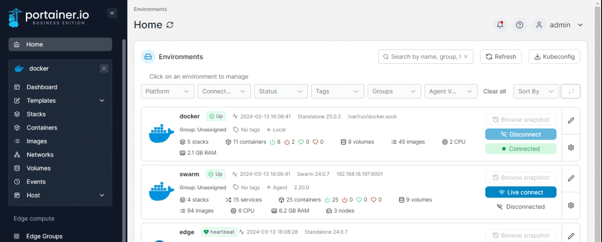
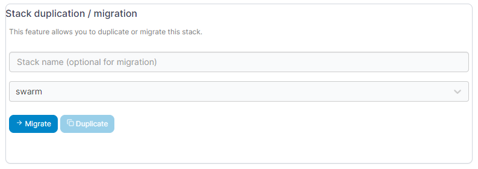
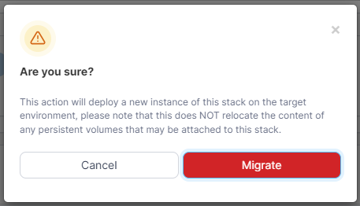
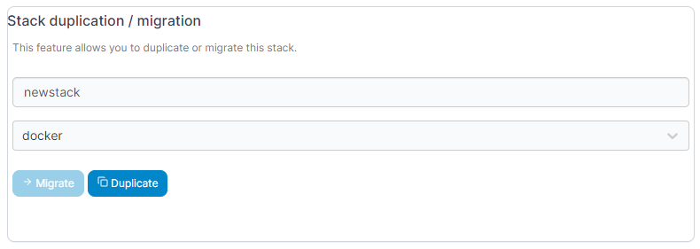

# Migrate or duplicate a stack

## Migrating a stack

From the menu select **Stacks** then select the stack you want to migrate.

<figure><figcaption></figcaption></figure>

In the **Stack duplication / migration** section, select the destination environment for the stack, and optionally define a new name for the stack. Click **Migrate**.

<figure><figcaption></figcaption></figure>

When the confirmation message appears, click **Migrate**.

<figure><figcaption></figcaption></figure>

## Duplicating a stack

From the menu select **Stacks** then select the stack you want to duplicate.

<figure><figcaption></figcaption></figure>

In the **Stack duplication / migration** section, give the new stack a descriptive name then select the environment that the stack is currently on.

<figure><figcaption></figcaption></figure>

When you're ready, click **Duplicate**.

