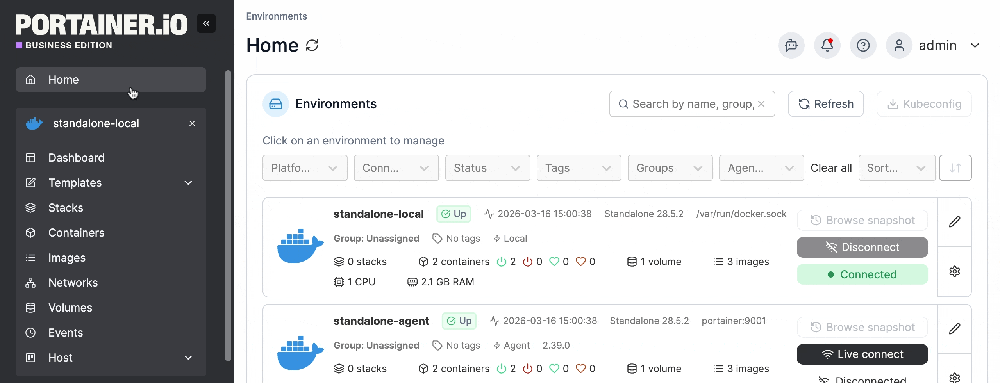
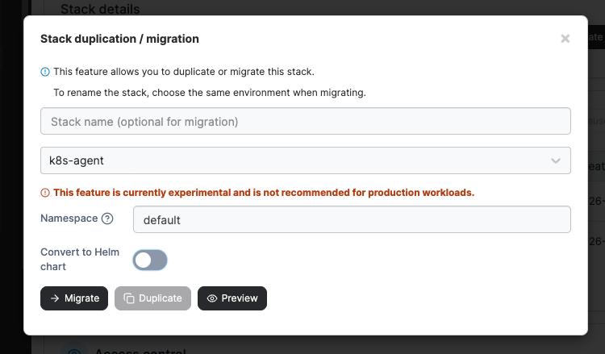
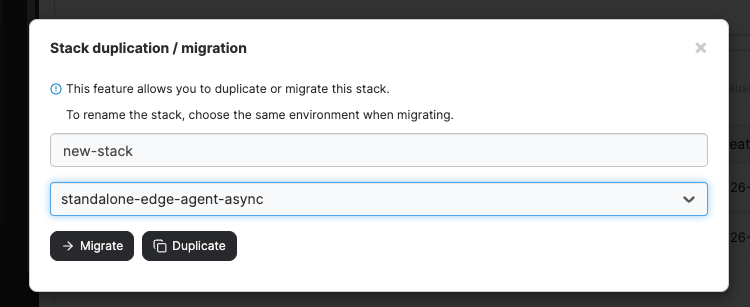
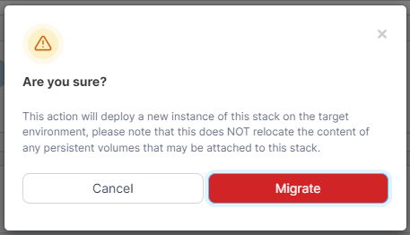
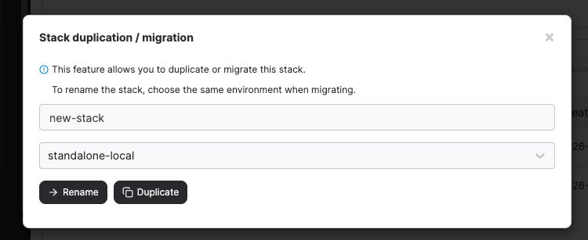
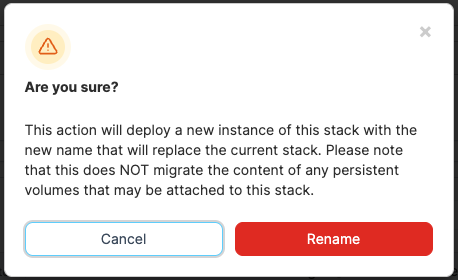

# Migrate, duplicate or rename a stack

To migrate, duplicate, or rename a stack, open your environment, go to **Stacks**, and select the stack you want to change.

<figure><figcaption></figcaption></figure>

## Migrating a stack

### Docker Compose to Kubernetes migration


Migrating Docker stacks to Kubernetes is currently an experimental feature and is not recommended for production workloads.

Before starting the migration, we recommend [taking a backup](../../../admin/settings/general.md#back-up-portainer).


Portainer allows you to migrate your Docker Compose workloads to Kubernetes. This feature uses the [Kompose](https://kompose.io/) tool to convert Docker Compose definitions into Kubernetes resources.

From the stack you want to migrate, select **Migrate this stack**. In the dialog box that appears, select your Kubernetes environment as the destination for the migration, then complete the fields as described below. Click **Migrate**.

| Field                 | Overview                                                                                                                                                             |
| --------------------- | -------------------------------------------------------------------------------------------------------------------------------------------------------------------- |
| Namespace             | Specify the [namespace](../../kubernetes/namespaces/) you wish to migrate to. If the namespace you enter does not exist, a new one will be created during migration. |
| Convert to Helm chart | Toggle this on to convert your stack to a Helm chart. Note that if migrating to a Helm chart, the preview function will no longer be an option.                      |

<figure><figcaption></figcaption></figure>

### Migration between Docker environments

From the stack you want to migrate, select **Migrate this stack**. Select the destination environment for the stack, and optionally define a new name for the stack. Click **Migrate**.

<figure><figcaption></figcaption></figure>

Migrating does not relocate the content of any persistent volumes that may be attached to the stack. Acknowledge this warning and confirm the migration by clicking **Migrate**.

<figure><figcaption></figcaption></figure>

## Duplicating a stack

From the stack you want to duplicate, select **Migrate this stack**. Give the new stack a descriptive name then select the environment the stack should duplicate to. Click **Duplicate**.

<figure><figcaption></figcaption></figure>

## Rename a stack

From the stack you want to rename, select **Migrate this stack**. Give the stack a new descriptive name and select the environment that the stack is currently on. Click **Rename**.

<figure><figcaption></figcaption></figure>

Renaming the stack creates a new stack instance and does not transfer the content of any persistent volumes that may be attached to the stack. Acknowledge this warning and confirm the migration by clicking **Rename**.

<figure><figcaption></figcaption></figure>
