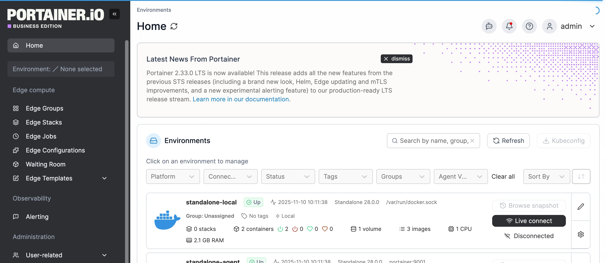
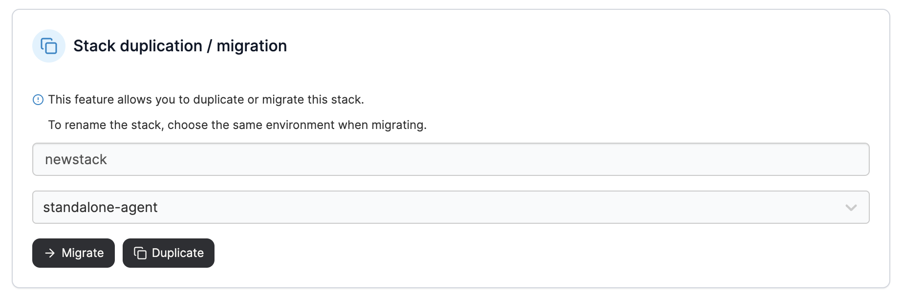

---
metaLinks:
  alternates:
    - https://app.gitbook.com/s/udjBY77rL45c6FTs07xf/user/docker/stacks/migrate
---

# Migrate, duplicate or rename a stack

To migrate, duplicate, or rename a stack, open your environment, go to **Stacks**, and select the stack you want to change.

<figure><figcaption></figcaption></figure>

## Migrating a stack

In the **Stack duplication / migration** section, select the destination environment for the stack, and optionally define a new name for the stack. Click **Migrate**.

<figure><figcaption></figcaption></figure>

Migrating does not relocate the content of any persistent volumes that may be attached to the stack. Acknowledge this warning and confirm the migration by clicking **Migrate**.

<figure><figcaption></figcaption></figure>

## Duplicating a stack

In the **Stack duplication / migration** section, give the new stack a descriptive name then select the environment the stack should duplicate to. When you're ready, click **Duplicate**.

<figure><figcaption></figcaption></figure>

## Rename a stack

In the **Stack duplication / migration** section, give the stack a new descriptive name and select the environment that the stack is currently on. When you're ready, click **Rename**.&#x20;

<figure><figcaption></figcaption></figure>

Renaming creates a new stack instance and does not transfer the content of any persistent volumes that may be attached to the stack. Acknowledge this warning and confirm the migration by clicking **Rename**.

<figure><figcaption></figcaption></figure>
