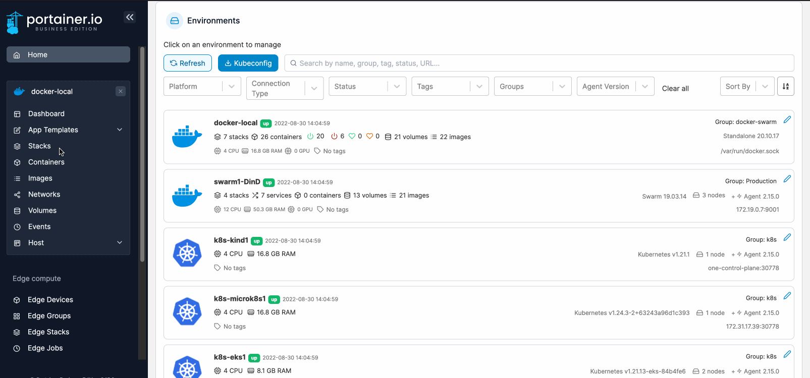
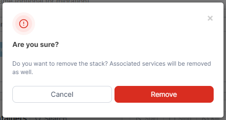

# Remove a stack

From the menu select **Stacks**, tick the checkbox next to the stack you want to remove, then click **Delete this stack**.&#x20;

<figure><figcaption></figcaption></figure>

When the confirmation message appears, click **Remove**.

<figure><figcaption></figcaption></figure>
