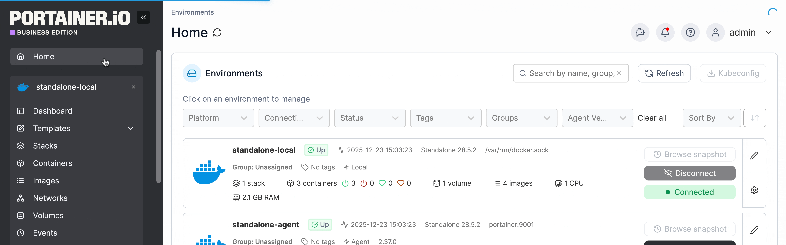
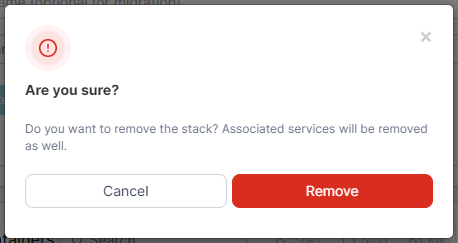

---
metaLinks:
  alternates:
    - https://app.gitbook.com/s/Dalese9Lv4CX6YKS1s45/user/docker/stacks/remove
---

# Remove a stack

From the menu select **Stacks**, tick the checkbox next to the stack you want to remove, then click **Remove**.

<figure><figcaption></figcaption></figure>

When the confirmation message appears, click **Remove**.

<figure><figcaption></figcaption></figure>
