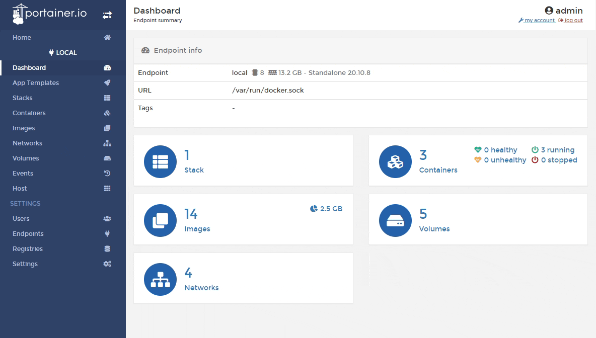
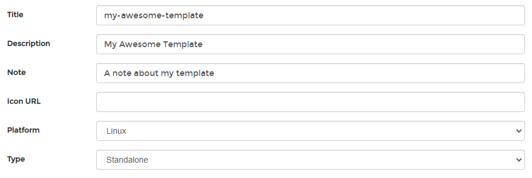
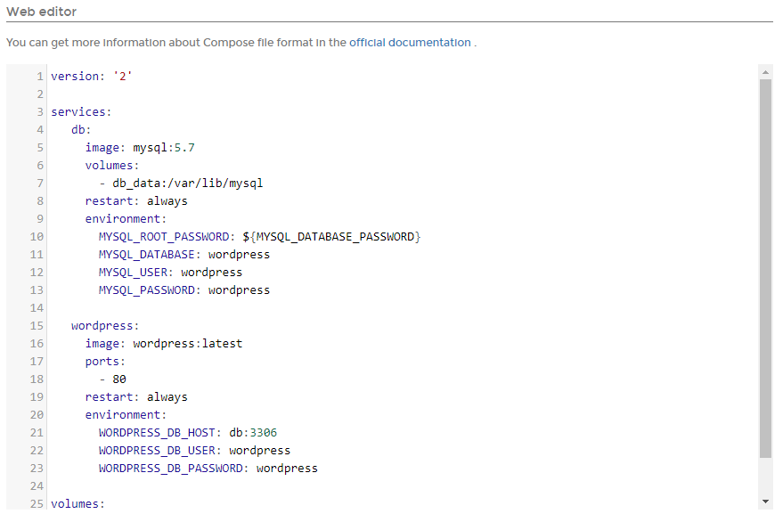

# Create a template from a deployed stack

In Portainer you can create an [app template](../templates/) from deployed stacks. This is useful if you need to deploy the same stack several times.

From the menu select **Stacks**, select the already-deployed stack, then click **Create template from stack**.

Define some properties for the new template, using the table below as a guide.

| Field/Option | Overview |
| :--- | :--- |
| Title | Give the template a descriptive name. |
| Description | Enter a brief description of what your template includes. |
| Note | Note any extra information about the template \(optional\). |
| Icon URL | Enter the URL to an icon to be used for the template when it appears in the list \(optional\). |
| Platform | Select the compatible platform for the template. Options are **Linux** or **Windows**. |
| Type | Select the type of template. Options are **Standalone** or **Swarm**. |

The **Web editor** will be pre-populated with the Compose file for your stack. Make any changes you need here.

When you're ready, click **Create custom template**.

