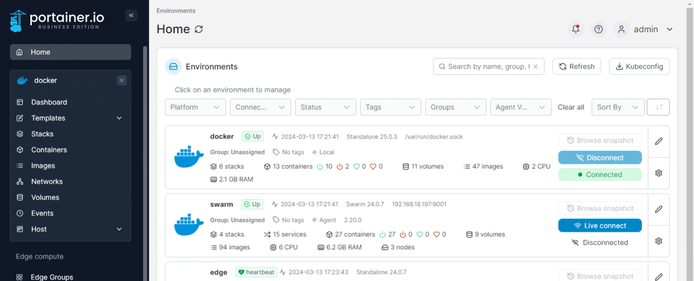

# Webhooks in Portainer

A webhook is a POST request sent to a specified URL in Docker Hub or another registry. Webhooks help automate actions in response to events like repository pushes, enabling seamless CI/CD workflows.


This functionality is only available in [Portainer Business Edition](https://www.portainer.io/business-upsell?from=stack-webhook).



Webhooks are only available on non-Edge environments (Portainer Server or Portainer Agent). They are not supported on Portainer Edge Agent since its tunnel opens on-demand, preventing permanent webhook exposure.


## Enabling a Stack Webhook

To configure a webhook for a stack:

1. Navigate to **Stacks** in the Portainer UI.
2. Select the stack you want to configure.
3. Click on the **Edit** tab.

<figure></figure>

4. Scroll to the **Webhooks** section.
5. Toggle **Create a stack webhook**.
6. Copy the generated webhook URL and use it to configure your registry.

<figure></figure>

## Triggering Webhooks

Once set up, you can trigger the webhook in different ways. Here are examples:

### Redeploy Stack Containers with the Latest Image
```html
<form action="https://portainer:9443/api/stacks/webhooks/638e6967-ef77-4906-8af8-236800621360" method="post">
  Redeploy stack containers with latest image of same tag <input type="submit" />
</form>
```

### Update Stack to Use a Different Image Tag
```html
<form action="https://portainer:9443/api/stacks/webhooks/638e6967-ef77-4906-8af8-236800621360?tag=latest" method="post">
  Update stack container images with different tag <input type="submit" />
</form>
```

## Preventing Image Pull During Redeploy

By default, triggering a webhook pulls the latest image. If you want to redeploy without pulling a new image, use the `pullimage=false` parameter:


This option is only available in Portainer Business Edition.


```html
<form action="https://portainer:9443/api/stacks/webhooks/638e6967-ef77-4906-8af8-236800621360?pullimage=false" method="post">
  Update stack without pulling images <input type="submit" />
</form>
```

## Using Environment Variables with Webhooks

Webhooks support passing environment variables, which can be referenced in stack Compose files. To specify a variable, add it as a query parameter:

**Example:** Passing a `SERVICE_TAG` variable with value `development`:
```
https://portainer:9443/api/stacks/webhooks/1d251d96-fb34-4172-a0a1-d0655467b897?SERVICE_TAG=development
```

To use this variable in a Compose file with a default fallback:
```yaml
services:
  my-service:
    image: repository/image:${SERVICE_TAG:-stable}
```


## Testing Webhooks

Before integrating the webhook in a production environment, it's best to test it using tools like:

| Tool          | Description |
|--------------|-------------|
| [Beeceptor](https://beeceptor.com/) | Set up a test endpoint to inspect webhook payloads. |
| [Webhook.site](https://webhook.site/) | View incoming webhook requests and debug responses. |
| [RequestBin](https://pipedream.com/requestbin) | Create a temporary webhook endpoint for testing. |

## Configuring the Webhook in Docker Hub

To complete the setup, refer to [Docker's official documentation](https://docs.docker.com/docker-hub/webhooks/) for guidance on configuring webhooks in Docker Hub.
