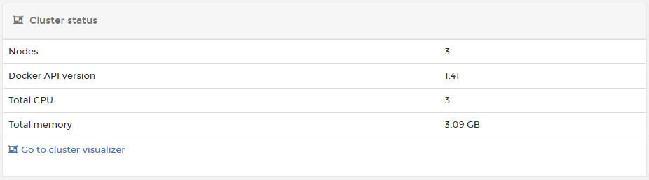
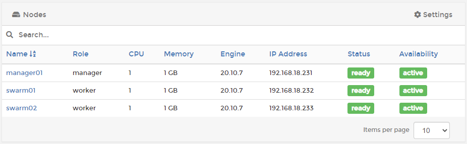
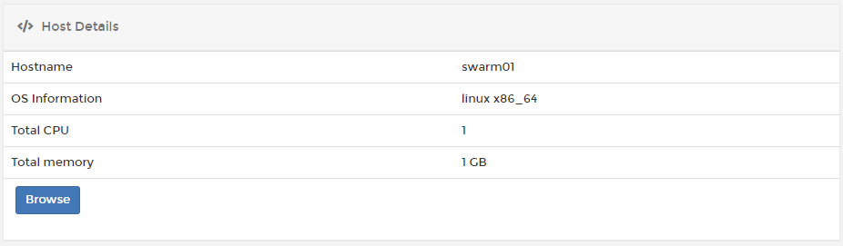
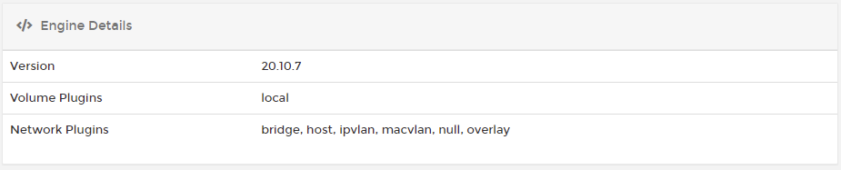
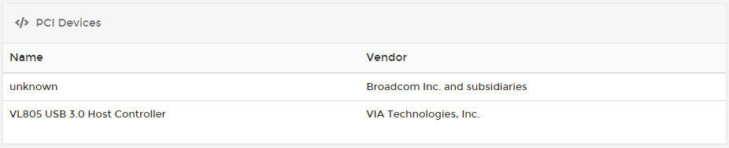
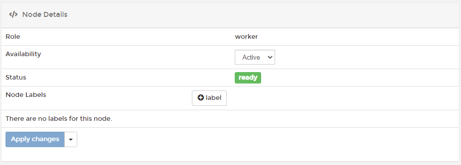

# Swarm


The **Swarm** menu is only available to Docker Swarm environments.


This section provides an overview of your Swarm environment. You can view information about environments and nodes, view cluster information, and configure environment-specific settings.


[setup.md](setup.md)


## Cluster status

This section describes the cluster's basic configuration, including the number of nodes, the Docker API version, and the total CPU and memory available. A link to the [cluster visualizer](cluster-visualizer.md) is also included.

## Nodes

Lists all of the nodes in the cluster along with a summary of each node, including:

* The role of the node.
* The number of CPUs and memory available on the node.
* The Docker Engine version running on the node.
* The node's IP address.
* The status and availability of the node.

Clicking on an individual node's name will take you to an overview page for that node.

## Node overview

### Host Details

This section describes the node's basic configuration, including the hostname, OS information, and total CPU and memory.

### Engine Details

Information such as the Docker version and the available volume and network plugins helps you to understand more about the Docker engine running on your node.

### PCI Devices and Physical Disks

These sections list the available PCI devices and physical disks on the node.&#x20;


These sections are only visible when [host management features](setup.md#enable-host-management-features) are enabled for the cluster.


### Node Details

Here you'll find details about the node's configuration as part of the cluster. You can view the role, set the availability status of the node, view the current status and apply labels to the node.

