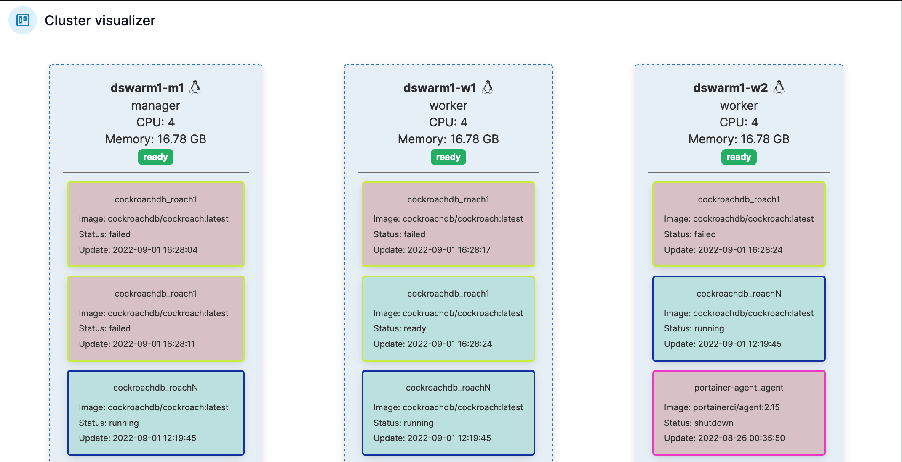

# Cluster visualizer


This feature is only available to Docker Swarm environments.


The **Cluster visualizer** section gives you an overview of your cluster and the tasks on it.

## Cluster information

View the details about the cluster including the number of nodes, services and tasks. You can also adjust the visualizer display.

<figure><figcaption></figcaption></figure>

### Options

**Only display running tasks** filters the task list in the visualizer to only include running tasks.&#x20;

**Display node labels** toggles the display of labels on the nodes in the visualizer.

### Refresh

Use this option to define the refresh rate of the visualizer (the default is every 5 seconds).

## Cluster visualizer

The **Cluster visualizer** section gives you a visual representation of the nodes in your cluster and the tasks on each node.&#x20;

<figure><figcaption></figcaption></figure>

