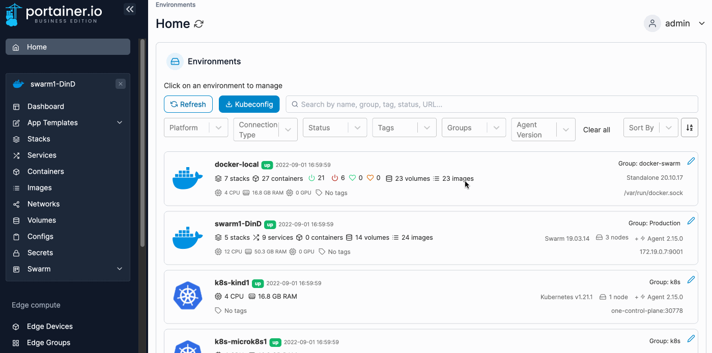
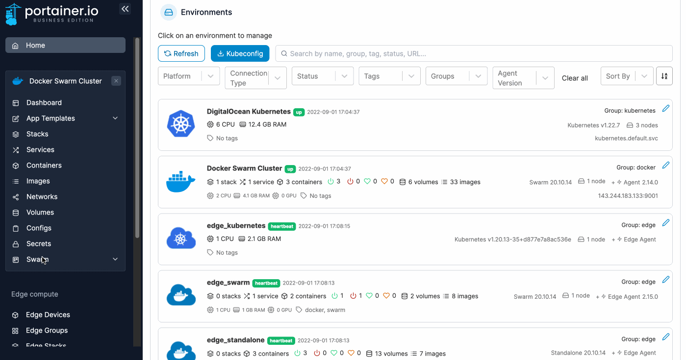
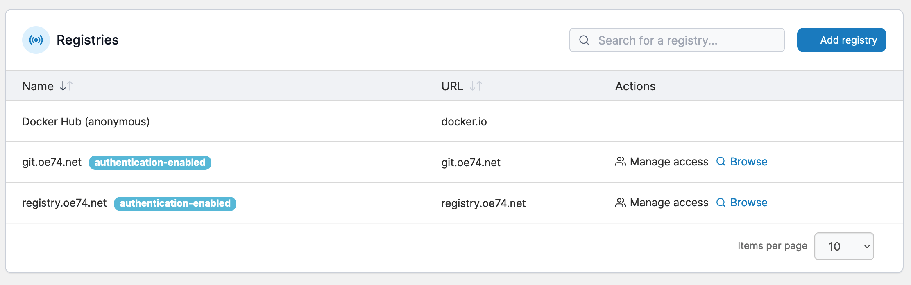

# Registries

**Registries** lets you manage access to each of the registries that are currently available.


Registry access assigned here only applies to the selected environment. It is not global.


## Adding a new registry

From the menu select **Swarm**, select **Registries** then click **Add registry**. When the global registries page appears, follow [these instructions](../../../admin/registries/add/).

<figure><figcaption></figcaption></figure>

## Managing access

To configure access to a registry, from the menu select **Swarm** then select **Registries**.

<figure><figcaption></figcaption></figure>

Find the registry you want to manage then select **Manage access**.&#x20;

<figure><figcaption></figcaption></figure>

From the dropdown, select the users or teams that you would like to have access then click **Create access**.

<figure><figcaption></figcaption></figure>
