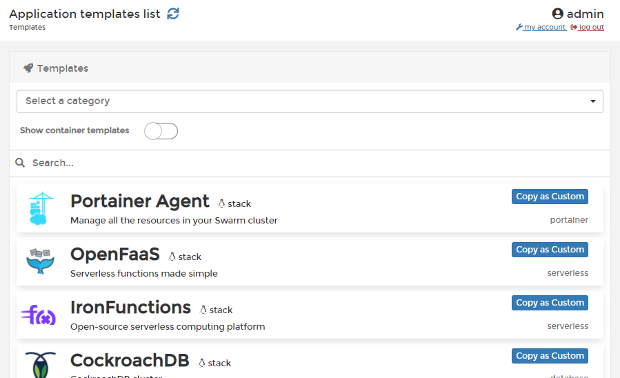

# App Templates

An app template lets you deploy a container \(or a stack of containers\) to an environment with a set of predetermined configuration values while still allowing you to customize the configuration \(for example, environment variables\).

Portainer supports templates of both individual containers and stacks of containers.





By default, Portainer provides a pre-built set of app templates, but you are free to modify or [replace these with your own](../../../advanced/app-templates/build.md). You can also create your own custom templates either manually or from an existing stack.





