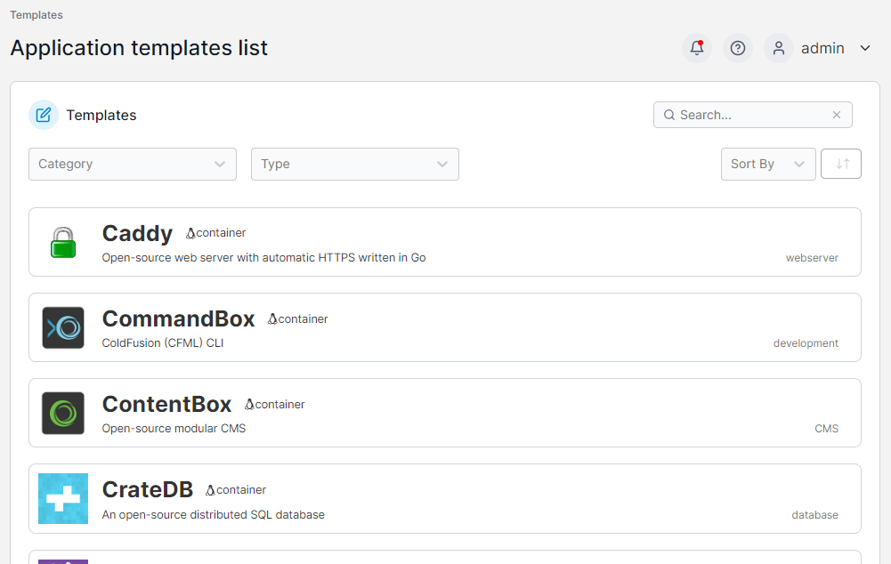

# Application

An application template lets you deploy a container (or a stack of containers) to an environment with a set of predetermined configuration values while still allowing you to customize the configuration (for example, environment variables). This page lists the application templates available to deploy on your environment.

<figure><figcaption></figcaption></figure>

Portainer supports templates of both individual containers and stacks of containers.


[deploy-stack.md](deploy-stack.md)



[deploy-container.md](deploy-container.md)


By default, Portainer provides a pre-built set of app templates, but you are free to modify or [replace these with your own](../../../advanced/app-templates/build.md). You can also create your own custom templates either manually or from an existing stack.
