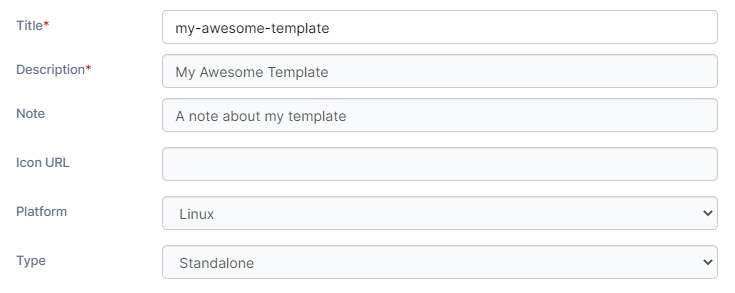
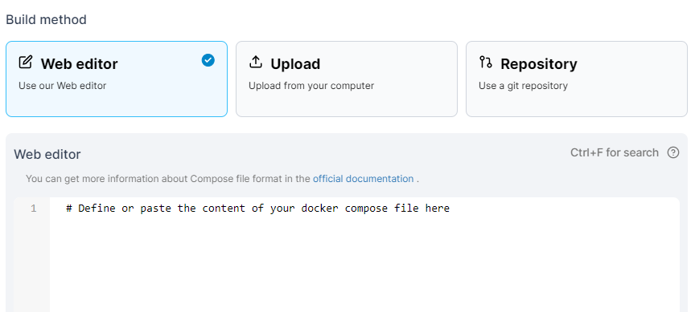
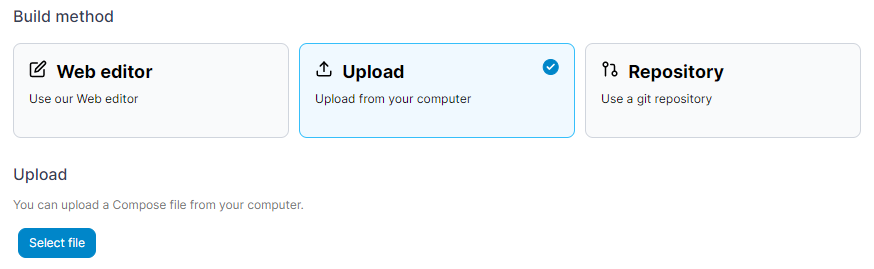
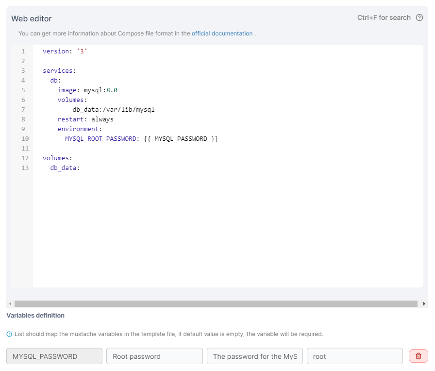
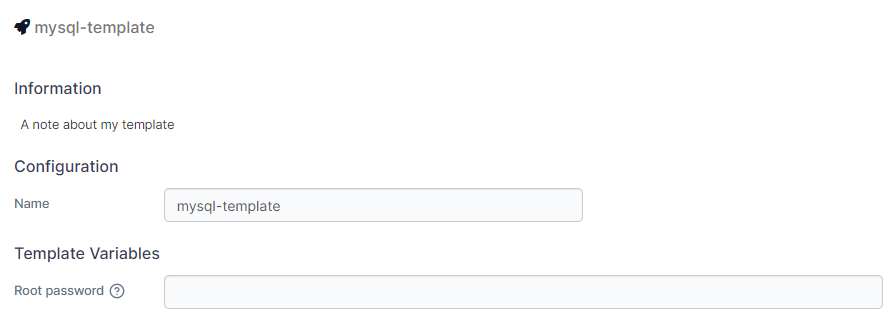

# Custom templates

A custom template can be used to help streamline the deployment of a container or stack.


You can also [create a template from an existing deployed stack](../stacks/template.md).


## Viewing the list of custom templates

To view a list of custom templates, from the menu select **App Templates** then select **Custom Templates**.

<figure><figcaption></figcaption></figure>

## Creating a new custom template

### Entering the basic information

Click **Add Custom Template** then complete the details, using the table below as a guide.

| Field/Option | Overview                                                                                     |
| ------------ | -------------------------------------------------------------------------------------------- |
| Title        | Give the template a descriptive name.                                                        |
| Description  | Enter a brief description of what your template includes.                                    |
| Note         | Note any extra information about the template (optional).                                    |
| Icon URL     | Enter the URL to an icon to be used for the template when it appears in the list (optional). |
| Platform     | Select the compatible platform for the template. Options are **Linux** or **Windows**.       |
| Type         | Select the type of template. Options are **Standalone** or **Swarm**.                        |

<figure><figcaption></figcaption></figure>

### Selecting the build method

Next, choose the build method that suits your needs. You can use the web editor to manually enter your docker-compose file, upload a docker-compose.yml file from your local computer, or pull the compose file from a Git repository.

#### Web editor

Paste the contents of your docker-compose file into the box provided. Once all the details have been completed, click **Create custom template**.


You can search within the web editor at any time by pressing `Ctrl-F` (or `Cmd-F` on Mac).


<figure><figcaption></figcaption></figure>

#### Upload

Click **Select file** to browse for a docker-compose file to upload. Once all the details have been completed, click **Create custom template**.

<figure><figcaption></figcaption></figure>

#### Git repository

Fill in the details for your Git repository.

| Field/Option         | Overview                                                                                                                      |
| -------------------- | ----------------------------------------------------------------------------------------------------------------------------- |
| Repository URL       | Enter the URL to your Git repository.                                                                                         |
| Repository reference | Enter the repository reference to define the branch or tag to pull from. If blank, the default `HEAD` reference will be used. |
| Compose path         | Enter the path within the repository to your docker-compose file.                                                             |

<figure><figcaption></figcaption></figure>

If your repository requires access authentication, toggle **Authentication** on then enter the username and personal access token. When all the details have been entered, click **Create custom template**.

## Variables in templates

Custom templates support the use of variables to provide further customization of the deployed stack. A stack can define a variable that can then be adjusted by the user at deployment.


This feature is only available in Portainer Business Edition.


Variables are identified in stacks with `{{ }}`. For example, the following stack provides a `MYSQL_PASSWORD` variable:

<figure><figcaption></figcaption></figure>

When a variable is defined, options appear to customize how the variable appears when deploying the stack. You can set the **label**, **description** and **default value**.

When a template is deployed, any variables that have been configured are editable:

<figure><figcaption></figcaption></figure>
