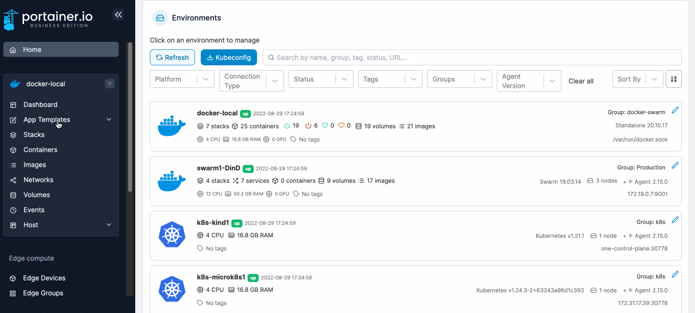

# Deploy a container

Portainer lets you deploy a standalone container from the default templates list.

From the menu select **App Templates**. Toggle **Show container templates** on then select the app that you want to deploy.

<figure><figcaption></figcaption></figure>

Define a name, a network, port mapping and volumes, and toggle **Enable access control** on if needed.

<figure><figcaption></figcaption></figure>

You can also make changes to container settings such as port and volume mapping, host file entries, labels and the hostname by clicking **Show advanced options**.

<figure><figcaption></figcaption></figure>

Once you have configured the container, click **Deploy the container**.
