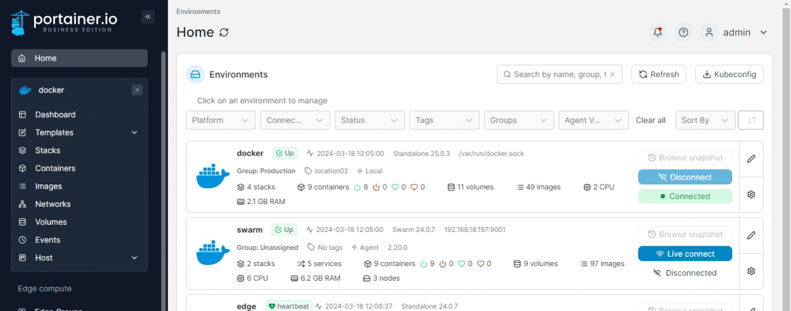
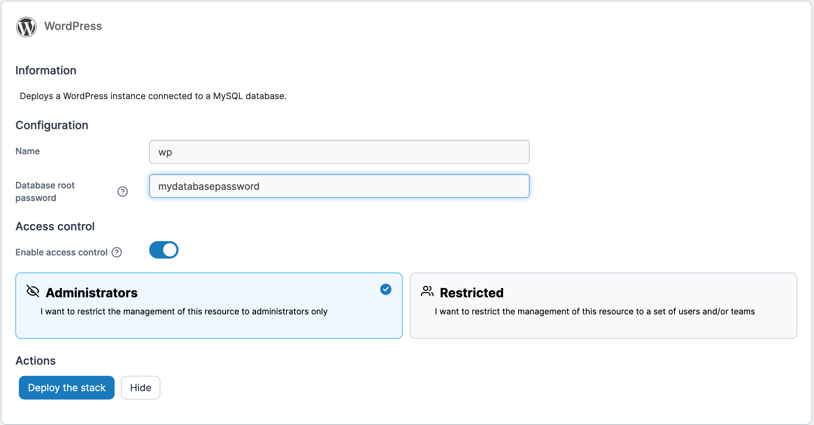
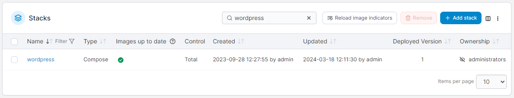

# Deploy a stack

Portainer lets you deploy an entire stack from either a default template or a custom template.


You can also [create a template from a stack](../stacks/template.md).


From the menu expand **Templates**, select **Application** or **Custom** (depending on the template) then select the template you want to deploy. In this example we'll create a WordPress stack.

<figure><figcaption></figcaption></figure>

Enter a name for the stack and set any required configuration values (these will differ from template to template). Toggle **Enable access control** on or off as required.

<figure><figcaption></figcaption></figure>

Click **Deploy the stack** then wait for the deployment to finish. If the deployment is successful, the new stack will appear in the list. Select it to view the [deployment details](../stacks/edit.md).

<figure><figcaption></figcaption></figure>
