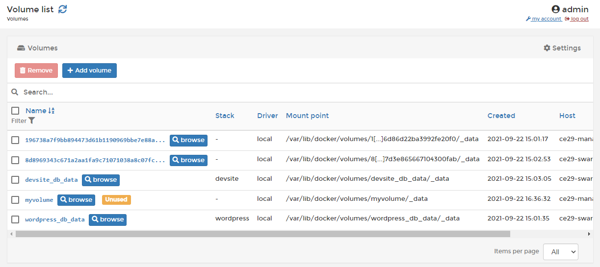

# Volumes

A volume is a data storage area that can be mounted into a container to provide persistent storage. Unlike bind mounts, volumes are independent of the underlying OS and are fully managed by the Docker Engine.

In Portainer you can view a list of the volumes on your environment, add new volumes and remove existing volumes.





If you're running Docker Swarm or the Portainer Agent on your environment, you can also browse existing volumes on that environment.



