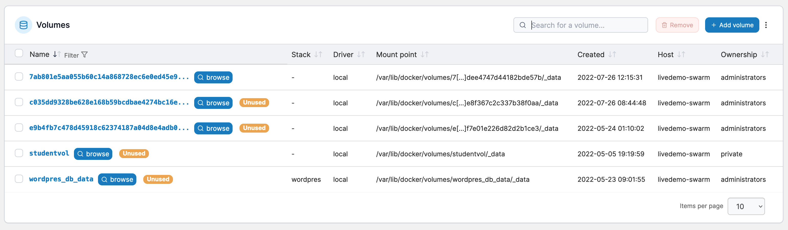

# Volumes

A volume is a data storage area that can be mounted into a container to provide persistent storage. Unlike bind mounts, volumes are independent of the underlying OS and are fully managed by the Docker Engine.

<figure><figcaption></figcaption></figure>

A volume with the **external** flag was created outside of Portainer, which means Portainer has limited knowledge on it compared to one created within Portainer. A label of **unused** means that Portainer cannot see any applications that are using this volume. This label may also appear on **external** resources because of the limited information available.

In Portainer you can view a list of the volumes on your environment, add new volumes and remove existing volumes.


[add.md](add.md)



[remove.md](remove.md)


If you're running Docker Swarm or the Portainer Agent on your environment, you can also browse existing volumes on that environment.


[browse.md](browse.md)


