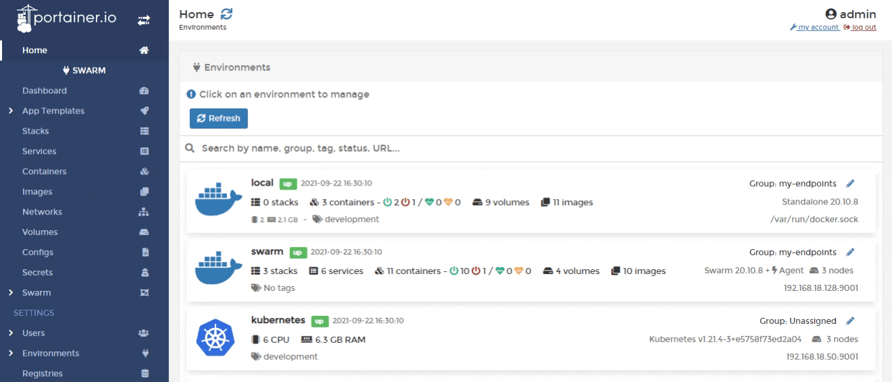
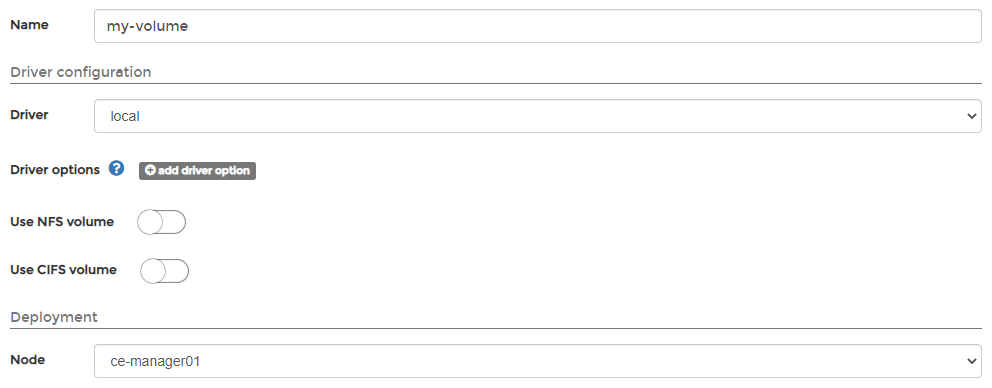
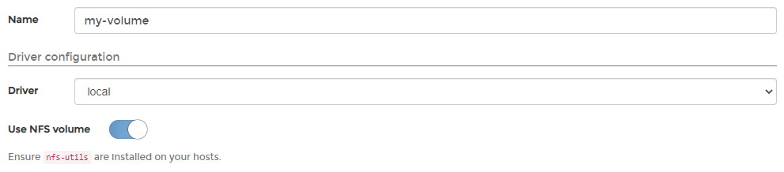
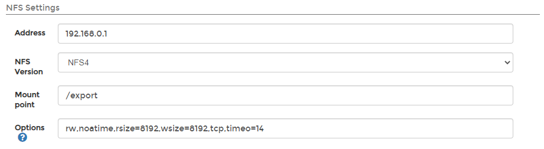
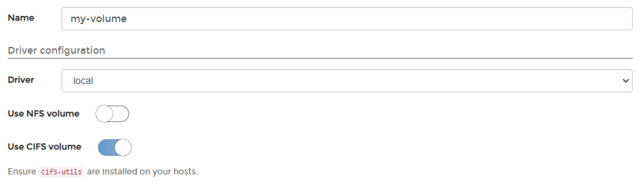
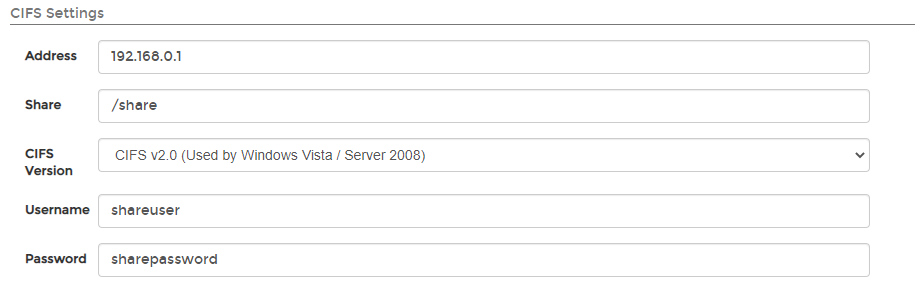
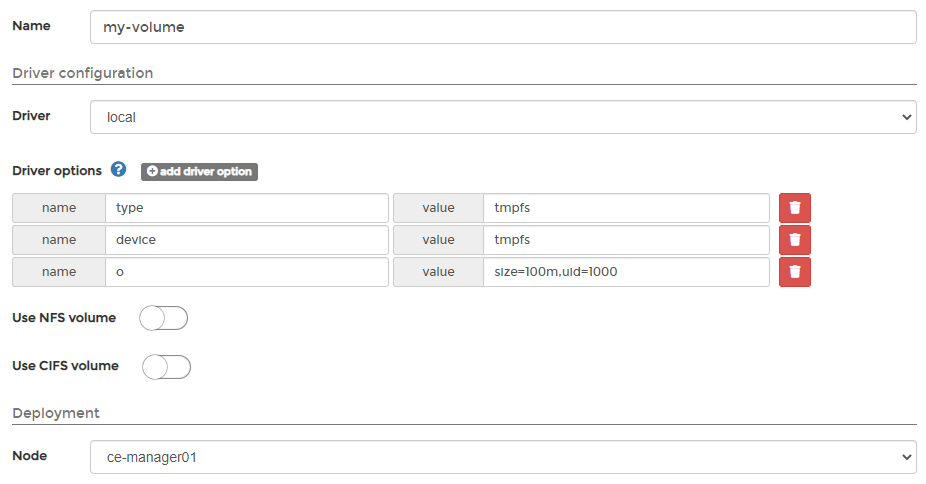
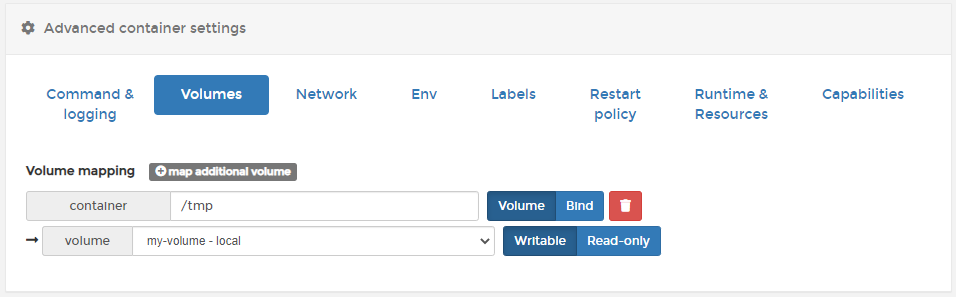
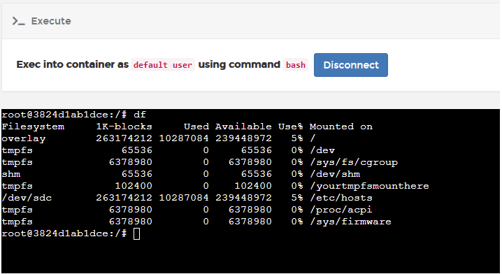

# Add a new volume

## Adding a local volume

From the menu select **Volumes** then click **Add volume**.

Complete the information in the **Create volume** screen, using the table below as a guide.

| Field/Option | Overview |
| :--- | :--- |
| Name | Give the volume a descriptive name. |
| Driver | Select `local`. |
| Use NFS volume | Toggle this off. |
| Use CIFS volume | Toggle this off. |
| Deployment | On a multi-node cluster, define the node that will hold the volume. |

When you're finished, click **Create the volume**.

## Adding an NFS volume


In Portainer, you can mount an NFS volume to persist the data of your containers.


From the menu select **Volumes** then click **Add volume**. 

Complete the information in the **Create volume** screen, using the table below as a guide.

| Field/Option | Overview |
| :--- | :--- |
| Name | Give the volume a descriptive name. |
| Driver | Select `local`. |
| Use NFS volume | Toggle this on. |
| Use CIFS volume | Toggle this off. |
| Deployment | On a multi-node cluster, define the node that will hold the volume. |

Under the **NFS Settings** section, complete the following.

| Field/Option | Overview |
| :--- | :--- |
| Address | Enter the hostname or IP address of your NFS server. |
| NFS Version | Select the NFS version that your NFS server uses. |
| Mount point | Enter the path where the volume is mounted, for example `/mnt/nfs01`. |
| Options | Leave the default values. |

When you're finished, click **Create the volume**.

## Adding a CIFS volume


In Portainer, you can mount a CIFS volume to persist the data of your containers.


From the menu select **Volumes** then click **Add volume**.

Complete the information in the **Create volume** screen, using the table below as a guide.

| Field/Option | Overview |
| :--- | :--- |
| Name | Give the volume a descriptive name. |
| Driver | Select `local`. |
| Use NFS volume | Toggle this off. |
| Use CIFS volume | Toggle this on. |
| Deployment | On a multi-node cluster, define the node that will hold the volume. |

Under the **CIFS Settings** section, complete the following:

| Field/Option | Overview |
| :--- | :--- |
| Address | Enter the CIFS server name or IP address. |
| Share | Enter the name of the share resource. |
| CIFS Version | Select the CIFS version that you are using. |
| Username | Enter the user to authenticate. |
| Password | Enter the password to authenticate. |

When you're finished, click **Create the volume**.

## Adding a tmpfs volume

From the menu select **Volumes** then click **Add volume**. 

Complete the information in the **Create volume** screen, using the table below as a guide.

<table>
  <thead>
    <tr>
      <th style="text-align:left">Field/Option</th>
      <th style="text-align:left">Overview</th>
    </tr>
  </thead>
  <tbody>
    <tr>
      <td style="text-align:left">Name</td>
      <td style="text-align:left">Give the volume a descriptive name.</td>
    </tr>
    <tr>
      <td style="text-align:left">Driver</td>
      <td style="text-align:left">Select <code>local</code>.</td>
    </tr>
    <tr>
      <td style="text-align:left">Driver options</td>
      <td style="text-align:left">Click <b>add driver option</b> then add the following name/value combinations:</td>
    </tr>
    <tr>
      <td style="text-align:left"></td>
      <td style="text-align:left">
        <ul>
          <li>
            
name: <code>type</code>
            

            
value: <code>tmpfs</code>
            

          </li>
          <li>
            
name: <code>device</code>
            

            
value: <code>tmpfs</code>
            

          </li>
          <li>name: <code>o</code>
          </li>
          <li>value: <code>size=100m,uid=1000</code> (customize these values to suit your
            needs)</li>
        </ul>
      </td>
    </tr>
    <tr>
      <td style="text-align:left">Use NFS volume</td>
      <td style="text-align:left">Toggle this off.</td>
    </tr>
    <tr>
      <td style="text-align:left">Use CIFS volume</td>
      <td style="text-align:left">Toggle this off.</td>
    </tr>
    <tr>
      <td style="text-align:left">Deployment</td>
      <td style="text-align:left">On a multi-node cluster, define the node that will hold the volume.</td>
    </tr>
  </tbody>
</table>

When you're finished, click **Create the volume**. The volume can now be attached to a container in the same way as any other volume.

Once attached, you can confirm that the tmpfs volume has been mounted correctly within the container:

