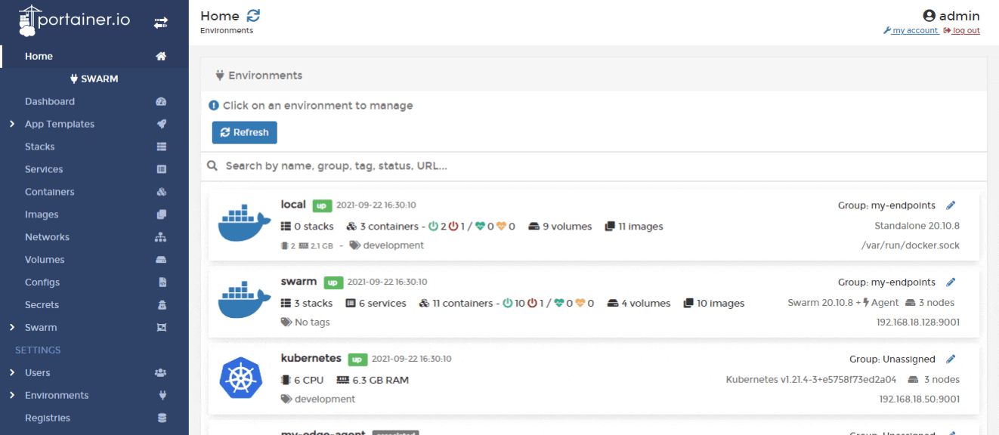
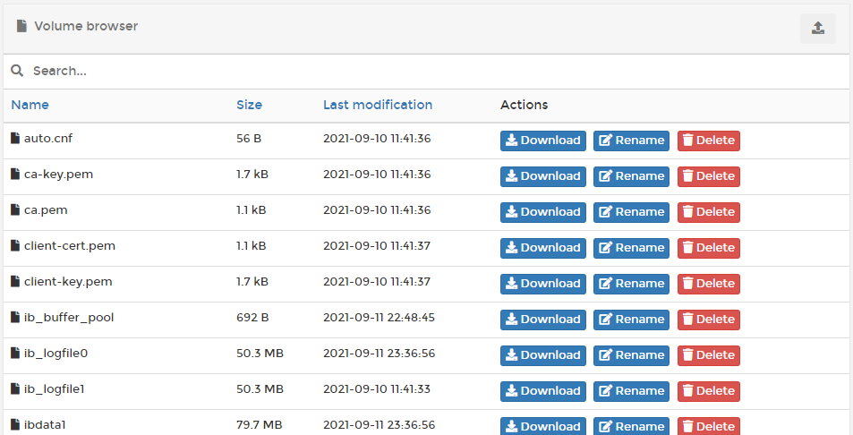

# Browse a volume


This feature is only available when running Docker Swarm or the Portainer Agent on the environment.


From the menu select **Volumes** then click **browse** next to the volume you want to explore.

You can upload files to the volume \(by clicking the icon in the top right\), and quickly expose them to the container without the need for a CLI. You can also download, rename and delete files in the volume.

