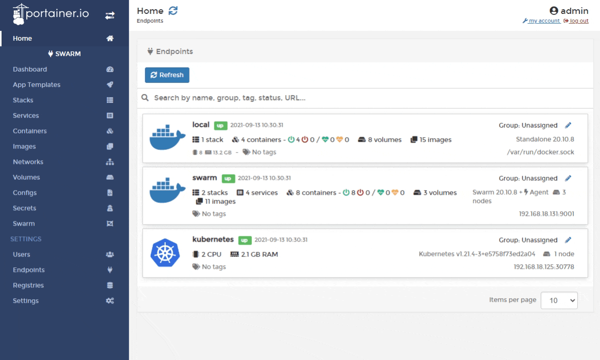

# Browse a volume


This feature is only available when running Docker Swarm or the Portainer Agent on the endpoint.


From the menu select **Volumes** then click **browse** next to the volume you want to explore.

You can upload files to the volume, and quickly expose them to the container without the need for a CLI.

