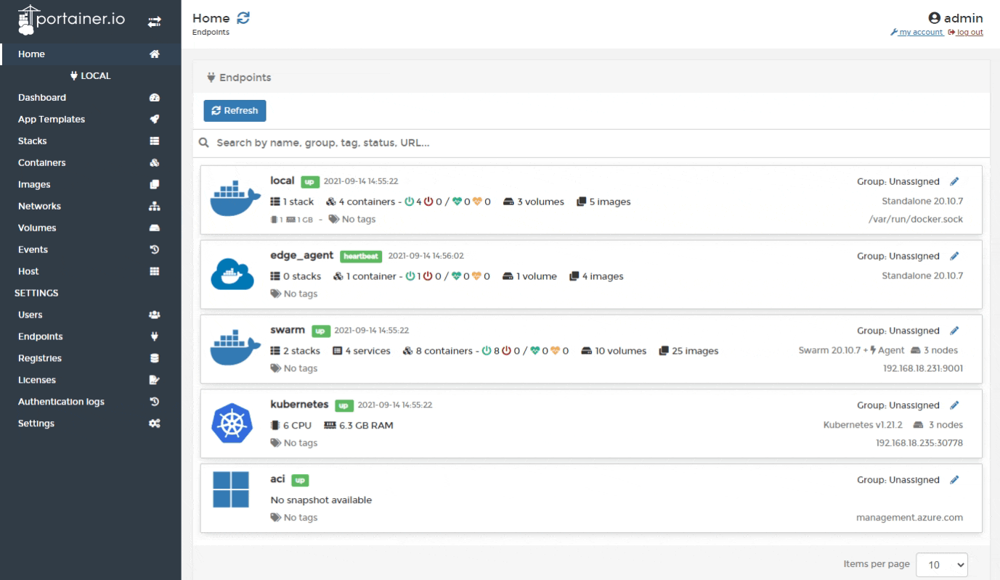
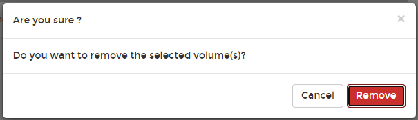

# Remove a volume


When you delete a volume, all of the content inside the volume will be erased.


From the menu select **Volumes**, tick the checkbox next to the volume you want remove then click **Remove**.


You cannot remove volumes attached to a container. If you want to do this, first remove the container then remove the volumes.


When the confirmation message appears, click **Remove**.

