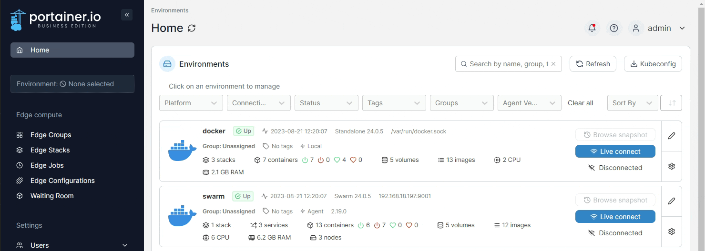
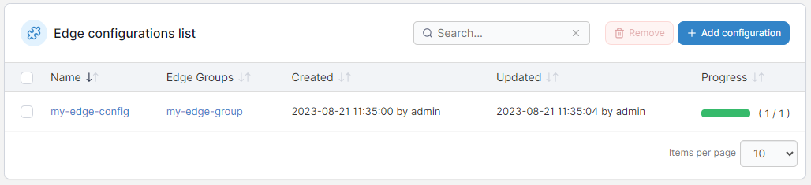
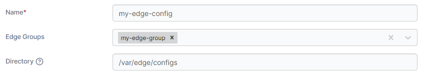
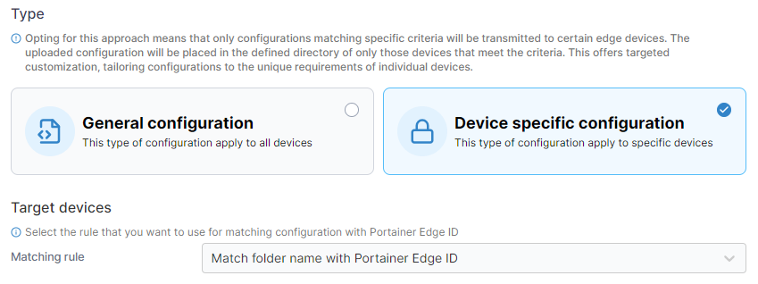
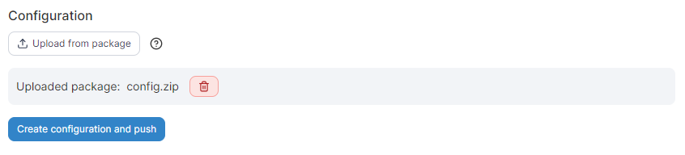

# Edge Configurations

Edge Configurations are sets of files that can be pre-deployed to your Edge environments in order to provide dynamic configurability on each Edge environment as well as avoid storing large amounts of config files in deployment repositories.

From the menu under **Edge compute** select **Edge Configurations**.

<figure><figcaption></figcaption></figure>

Here you can see a list of your current configurations, the Edge groups they apply to, creation and update dates, as well as the progress in pushing the configuration to your Edge environments.&#x20;

<figure><figcaption></figcaption></figure>

## Add a new configuration

To add a new configuration, click **Add configuration** and fill in the resulting form.

| Field/Option | Overview                                                                                                                                                                                            |
| ------------ | --------------------------------------------------------------------------------------------------------------------------------------------------------------------------------------------------- |
| Name         | Enter a name for your configuration.                                                                                                                                                                |
| Edge Groups  | Select the Edge groups this configuration will apply to.                                                                                                                                            |
| Directory    | Enter the directory on the Edge device that will be used to store the configurations. This directory should be the same on all devices, and should be writable by the user the Edge Agent runs as.  |

<figure><figcaption></figcaption></figure>

### Type

Next select the **Type** of configuration to deploy. When choosing the **General configuration** type, the contents of your configuration will be deployed to all devices in the selected groups in the directory specified, and the resulting configuration files will be available to all the devices in the same location.

<figure><figcaption></figcaption></figure>

Alternatively you can choose **Device specific configuration**, which will let you deploy subsets of the configuration to the devices you specify based on the Portainer Edge ID of the device.&#x20;


You can find the Edge IDs for your Edge environments under **Environments**, select the environment, and note the **Edge identifier** value in the **Edge information** box. It will look like the following:

`73149964-56f4-473b-81b3-5ecdc397e490`


You can specify the **Matching rule** to match either the file name or folder name within your configuration to the Portainer Edge ID.&#x20;

<figure><figcaption></figcaption></figure>

When using **file name** matching, any files in your configuration package with a filename (any extension) matching an Edge ID will be deployed to the matching remote Edge environment, in the location specified in the **Directory** field.&#x20;

When using **folder name** matching, any folders in your configuration package with a name matching an Edge ID will have their contents deployed to the matching remote Edge environment, in the location specified in the **Directory** field.

### Configuration

Finally, select a package to upload by clicking **Upload from package**. This package should be a ZIP file containing the configuration files you want to deploy on your Edge environments, with the contents structured based on the **Type** selected above.


When using folder name matching, your Edge ID named folders should be in the base directory of the package file contents and not in any subdirectories.


<figure><figcaption></figcaption></figure>

When you're ready, click **Create configuration and push**. Your configuration will be uploaded to Portainer and deployed to the relevant Edge environments based on your selections.

## Using your Edge Configurations in an Edge Stack

When using Edge Configurations, your files will be available at the path you specified on the selected Edge devices. You can reference this path directly in your Edge Stack configuration to access the files within.

When using a device specific configuration, your uploaded configuration will have a file name or folder name (depending on your **Matching rule** selection) based on the Portainer Edge ID of each device. You can reference this ID in your stack files with the `PORTAINER_EDGE_ID` environment variable. For example, to mount the device-specific folder in your container on each of the devices, you can use the following syntax:

```
version: '3'

services:
  myservice:
    image: myimage:latest
    volumes:
      - /var/edge/configs/${PORTAINER_EDGE_ID}:/my-device-config
```

In this example, each Edge device the stack was deployed to would mount their specific device (based on the Portainer Edge ID) folder to the `/my-device-config` folder in the container.
