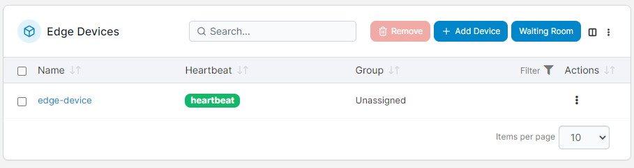

# Edge Devices

The Edge Devices feature lets you add, deploy and manage your Edge devices directly from within Portainer.


This functionality requires you to [enable Edge Compute](../../../admin/settings/edge.md) features.


<figure><figcaption></figcaption></figure>

To add a new Edge device, click the **Add Device** button. If you have [enabled FDO](../../../admin/settings/edge.md#fdo) you will be given the option to [provision a bare-metal device using Intel FDO](fdo.md) or to deploy the Edge Agent manually. If FDO is not enabled you will be taken directly to the [manual Edge Agent provision](../../../admin/environments/add/edge.md#adding-an-edge-environment-to-portainer).

If you have [enabled and configured OpenAMT](../../../admin/settings/edge.md#intel-openamt), you will also see an option to [Associate with OpenAMT](openamt.md).


[fdo.md](fdo.md)



[openamt.md](openamt.md)


If you have pre-deployed Edge devices with a [deployment script](../../../admin/settings/edge.md#automatic-edge-environment-creation), you can click the **Waiting room** button to check on any pending device connections.


[waiting-room.md](waiting-room.md)

