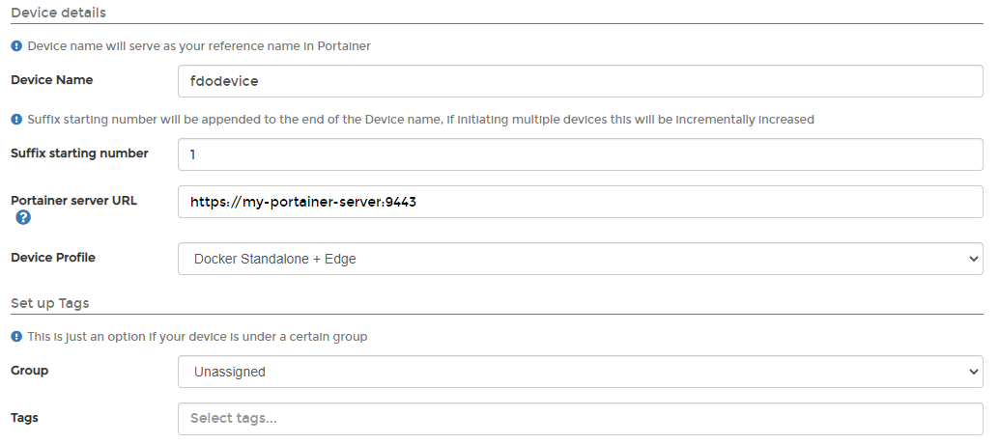

# FDO

The FIDO Device Onboard (FDO) protocol lets you create and deploy a device profile to remote bare-metal Edge devices, automating the configuration of the physical device to your specifications without any human interaction. Portainer provides the ability to do this from within the Portainer UI.

## Provision a FDO device

To add a new FDO device to Portainer you will first need to have [enabled and configured FDO](../../../admin/settings/edge.md#fdo). Once this is done, click **Add Device** and ensure the **Provision bare-metal using Intel FDO** option is selected, then click **Confirm**.

When provisioning an FDO device you will first need to import a Manufacturer Ownership Voucher. Click the **Upload** button and browse to the voucher on your system to upload.

Once the voucher is uploaded you will be able to fill in the device details as required.

| Field/Option           | Overview                                                                                                                                                                                                      |
| ---------------------- | ------------------------------------------------------------------------------------------------------------------------------------------------------------------------------------------------------------- |
| Device Name            | Enter the name of your device (how you want it to appear in Portainer).                                                                                                                                       |
| Suffix starting number | Enter the first number in the sequence you want to use for this device. This number will be appended to the **Device Name** and incremented for each device if you are provisioning multiple devices at once. |
| Portainer server URL   | Enter the URL for the Portainer Server instance that the devices will connect to. This URL must be accessible from the device.                                                                                |
| Device Profile         | Select the [device profile](../../../admin/settings/edge.md#device-profiles) you want to deploy to your device.                                                                                               |
| Group                  | Select a group to assign this device to.                                                                                                                                                                      |
| Tags                   | Select any tags you want to apply to this device.                                                                                                                                                             |

When you are ready, click **Save Configuration**.
