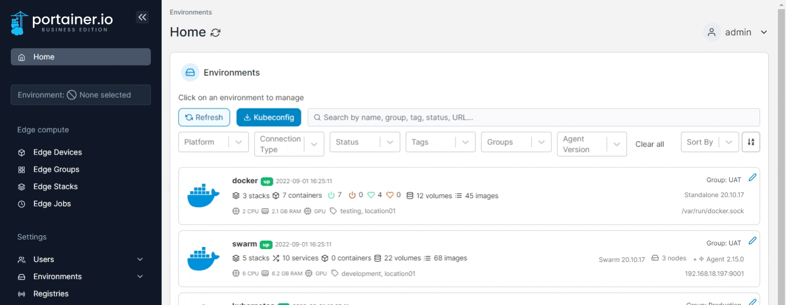
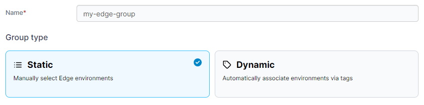
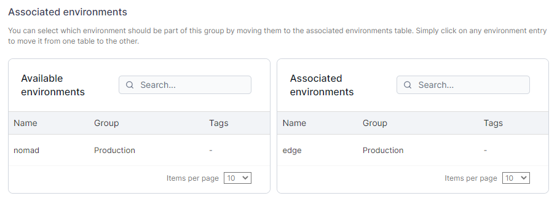
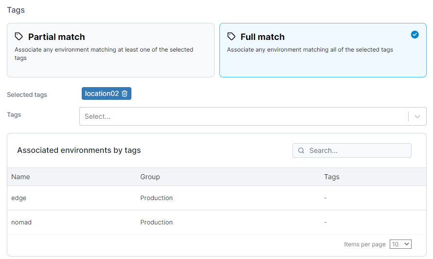

# Edge Groups

The Edge Groups feature lets you group together Edge environments either by manually selecting them or based on their [tags](../../admin/environments/tags.md). This is useful if you manage multiple Edge environments in multiple zones.


This functionality requires you to [enable Edge Compute](../../admin/settings/edge.md) features.


From the menu select **Edge Groups** then click **Add Edge group**.&#x20;

<figure><figcaption></figcaption></figure>

Give the group a descriptive name then select either **Static** or **Dynamic**:

<figure><figcaption></figcaption></figure>

### **Option 1: Static**

This option lets you manually add environments to the group from a list. Select the required environments then click **Add edge group**.

<figure><figcaption></figcaption></figure>

### Option 2: Dynamic

This option lets you automatically associate environments via their tags. If you choose this option you will need to refine how Edge environments are dynamically associated.

| Option        | Overview                                                                                                              |
| ------------- | --------------------------------------------------------------------------------------------------------------------- |
| Partial Match | Will associate any environments matching at least one of the selected tags (environments can have more than one tag). |
| Full Match    | Will associate any environments matching all of the selected tags.                                                    |

When you select a tag from the dropdown, environments with that tag will appear in the results.

<figure><figcaption></figcaption></figure>

Click **Add edge group** to associate the environments to the group.
