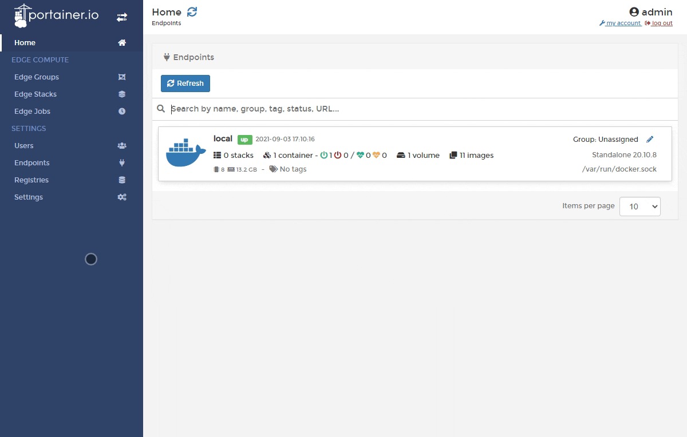
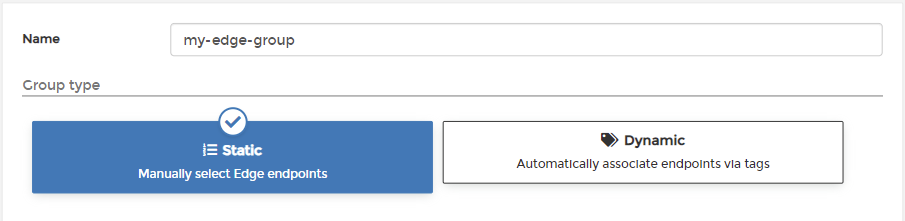
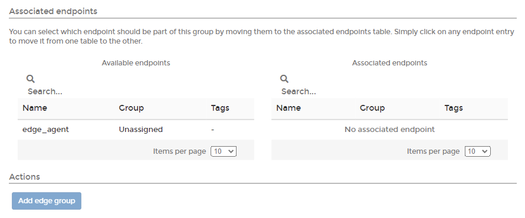
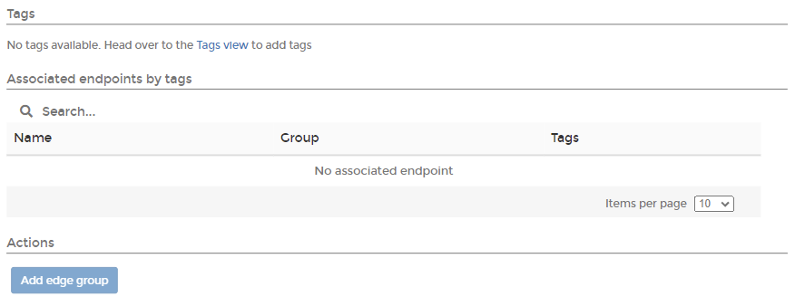

# Edge Groups

The Edge Groups feature lets you group together Edge endpoints either by manually selecting them or based on their [tags](../../admin/endpoints/tags.md). This is useful if you manage multiple Edge endpoints in multiple zones.


This functionality requires you to [enable Edge Compute](../../admin/settings/#edge-compute) features.


From the menu select **Edge Groups** then click **Add Edge group**. Give the group a descriptive name then select either **Static** or **Dynamic**:

### **Option 1: Static**

This option lets you manually add endpoints to the group from a list. Select the required endpoints then click **Add edge group**.

### Option 2: Dynamic

This option lets you automatically associate endpoints via their tags. If you choose this option you will need to refine how Edge endpoints are dynamically associated.

| Option | Overview |
| :--- | :--- |
| Partial Match | Will associate any endpoints matching at least one of the selected tags \(endpoints can have more than one tag\). |
| Full Match | Will associate any endpoints matching all of the selected tags. |

When you start typing a tag, endpoints with that tag will appear in the results. Click **Add edge group** to associate the endpoints to the group.

