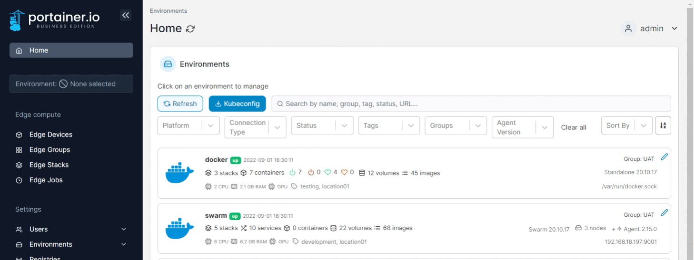
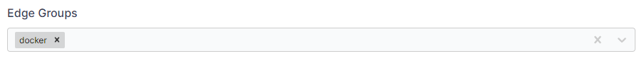
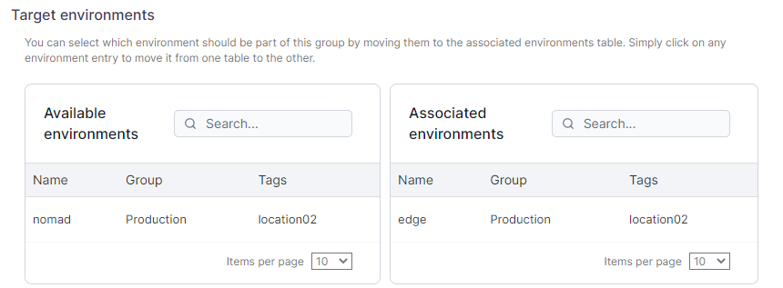

# Edge Jobs


This is a beta feature.


Adding an Edge job is a great way to schedule jobs in your Edge hosts. Jobs can be used to run any scripts you need, for example running a backup in a specified period of time.


This functionality requires you to [enable Edge Compute](../../admin/settings/edge.md) features, and is currently only available for Docker Standalone environments that use `/etc/cron.d` for job scheduling.



Edge jobs run by modifying the crontab on the underlying host, not in a container. This means that Edge jobs can make changes to the host directly, which is very powerful but also very dangerous, so use with caution.


From the menu select **Edge Jobs** then click **Add Edge job**.

<figure><figcaption></figcaption></figure>

Give the job a descriptive name then select one of the following options:

| Option                 | Overview                         |
| ---------------------- | -------------------------------- |
| Basic Configuration    | Select a date from the calendar. |
| Advanced Configuration | Write your own `cron` rule.      |

If you select **Recurring Edge job** also enter the **Edge job time**.


The Edge job time is based on the time on the host, not the Portainer Server. Bear this in mind when scheduling jobs across time zones.


<figure><figcaption></figcaption></figure>

You can then use the web editor to write the script or paste a copy in.

Once your script is ready, you can choose where to deploy it. You can select [Edge Groups](groups.md) to deploy to with the **Edge Groups** dropdown.

<figure><figcaption></figcaption></figure>

You can also select environments individually in **Target environments**. Click on an environment in the **Available environments** list to move it to the **Associated environments** list as a deployment target.

<figure><figcaption></figcaption></figure>

Once you have made your selections, click **Create edge job** to create and run the job.
