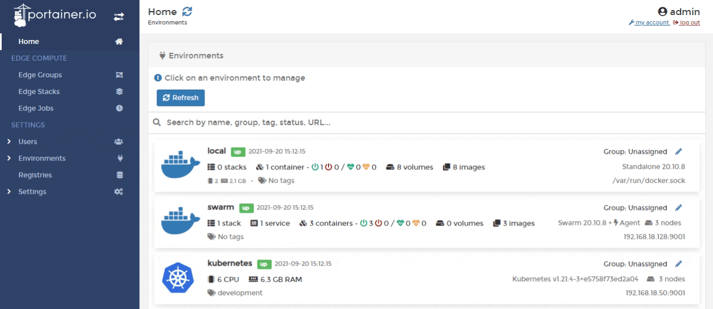
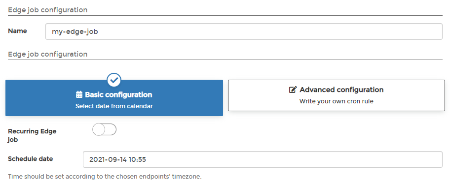

# Edge Jobs


This is a beta feature.


Adding an Edge job is a great way to schedule jobs in your Edge hosts. Jobs can be used to run any scripts you need, for example running a backup in a specified period of time.


This functionality requires you to [enable Edge Compute](../../admin/settings/edge.md) features.



Edge jobs run by modifying the crontab on the underlying host, not in a container. This means that Edge jobs can make changes to the host directly, which is very powerful but also very dangerous, so use with caution.


From the menu select **Edge Jobs** then click **Add Edge job**.

Give the job a descriptive name then select one of the following options:

| Option                 | Overview                         |
| ---------------------- | -------------------------------- |
| Basic Configuration    | Select a date from the calendar. |
| Advanced Configuration | Write your own `cron` rule.      |

If you select **Recurring Edge job** also enter the **Edge job time**.


The Edge job time is based on the time on the host, not the Portainer Server. Bear this in mind when scheduling jobs across time zones.


You can then use the web editor to write the script or paste a copy in. When the script is in place, from **Target environments** select the target environments, then click **Create edge job** to create and run the job.
