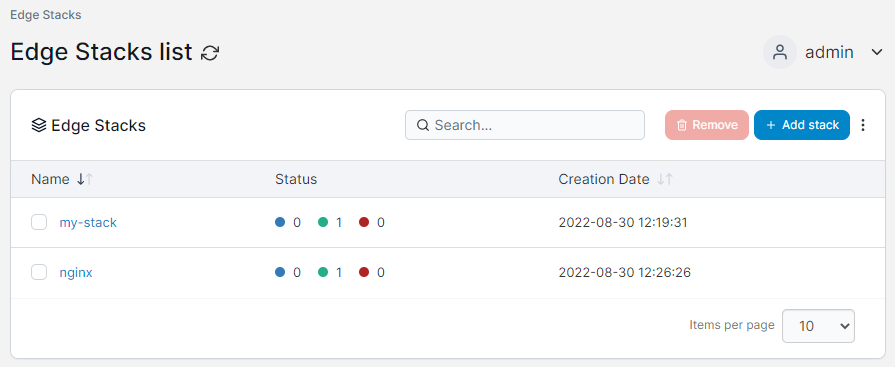
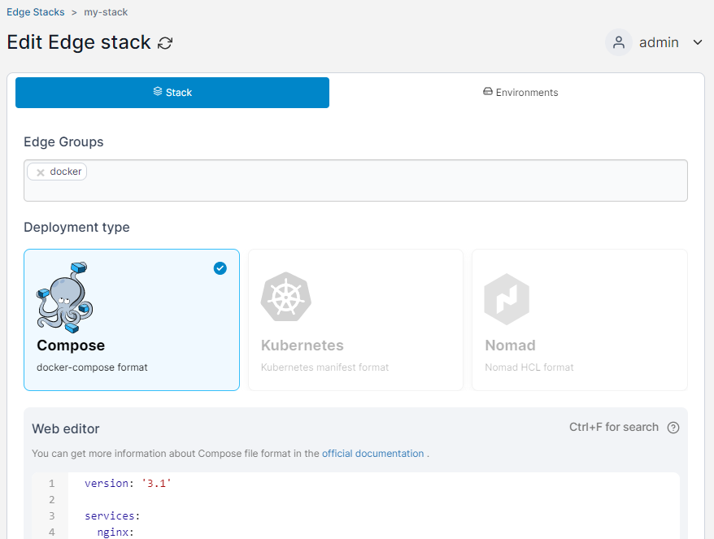
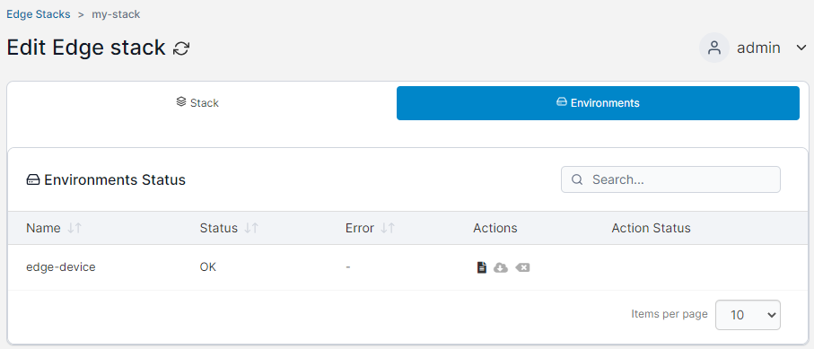
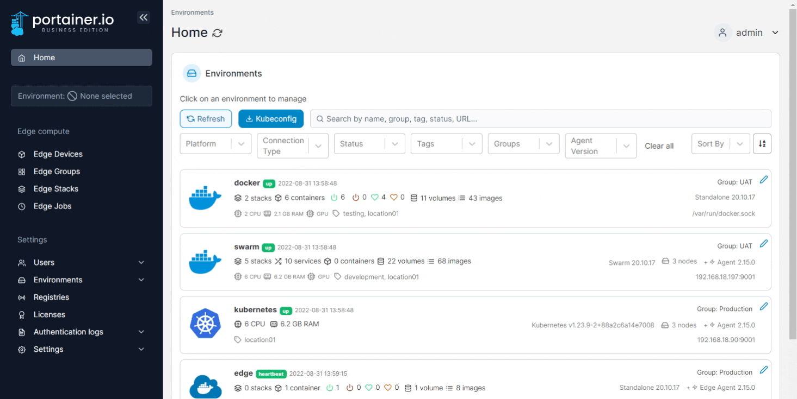
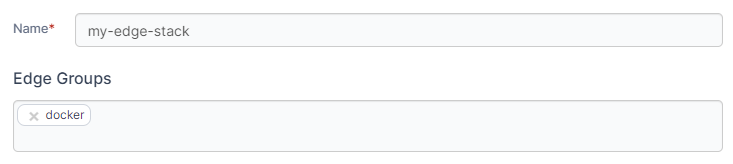

# Edge Stacks

Edge Stacks is a feature that lets you deploy multiple applications to multiple environments from a single page and multiple sources, regardless of their current state.&#x20;


This functionality requires you to [enable Edge Compute](../../admin/settings/edge.md) features.


The Edge Stacks page displays the list Edge Stacks deployed across your environments and devices and includes their name, the status of the deployment across the relevant environments (acknowledged, successful, and failed), and the creation date.

<figure><figcaption></figcaption></figure>

You can click on the individual stacks to edit the stack:

<figure><figcaption></figcaption></figure>

You can also view details about the stack's deployment across environments on the **Environments** tab, as well as retrieve, download, and clear retrieved log files from the respective environments (for stacks deployed on [Edge Devices](devices/)).

<figure><figcaption></figcaption></figure>

## Add a new stack

From the menu select **Edge Stacks** then click **Add stack**.

<figure><figcaption></figcaption></figure>

Give the stack a descriptive name then select one or more [Edge Groups](groups.md).

<figure><figcaption></figcaption></figure>

In **Deployment type**, select the type of deployment you are performing.


This may be auto-selected by your choice of [Edge Groups](groups.md).


<figure><figcaption></figcaption></figure>

In the **Build Method**, define how to deploy your app from one of the following options:

| Option     | Overview                                                                        |
| ---------- | ------------------------------------------------------------------------------- |
| Web editor | Use the Portainer web editor to write or paste in your build file.              |
| Upload     | Upload a build file from your computer.                                         |
| Repository | Use a GitHub repo where the build file is stored.                               |
| Template   | Use an Edge stack template. Only available for the **Compose** deployment type. |


You can search within the web editor at any time by pressing `Ctrl-F` (or `Cmd-F` on Mac).


<figure><figcaption></figcaption></figure>

If your stack requires access to images in private registries, you can specify which registry to use as part of the deployment.

<figure><figcaption></figcaption></figure>

Once the configuration is completed, click **Deploy stack**.
