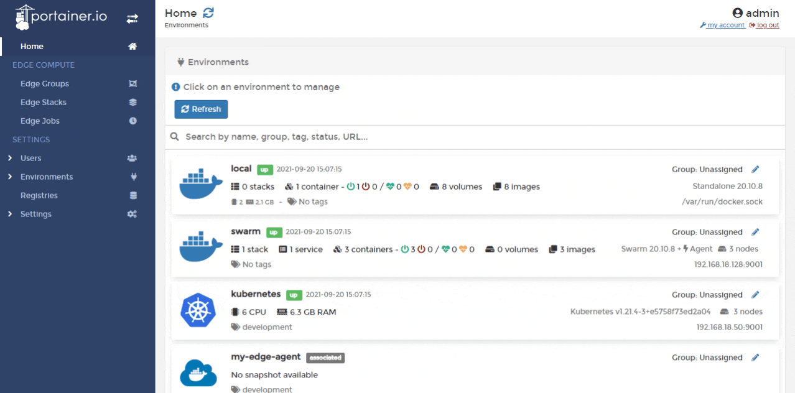
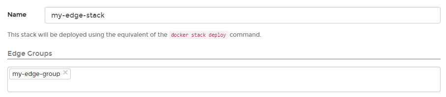
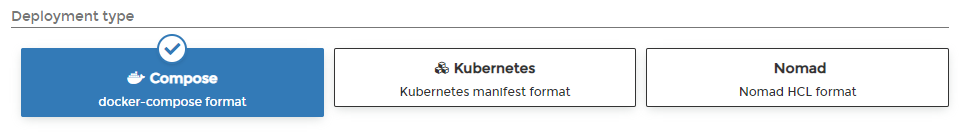

# Edge Stacks

Edge Stacks is a feature that lets you deploy multiple applications to multiple environments from a single page and multiple sources, regardless of their current state (online, disconnected, new).


This functionality requires you to [enable edge compute](../../admin/settings/#edge-compute) features.


From the menu select **Edge Stacks** then click **Add stack**.

Give the stack a descriptive name then select one or more [Edge groups](groups.md).

In **Deployment type**, select the type of deployment you are performing.


This may be auto-selected by your choice of **Edge Groups**.


In the **Build Method**, define how to deploy your app from one of the following options:

| Option     | Overview                                                                        |
| ---------- | ------------------------------------------------------------------------------- |
| Web Editor | Use the Portainer web editor to write or paste in your build file.              |
| Upload     | Upload a build file from your computer.                                         |
| Repository | Use a GitHub repo where the build file is stored.                               |
| Template   | Use an Edge stack template. Only available for the **Compose** deployment type. |

Once the configuration is completed, click **Deploy stack**.
