# Edge Stacks

Edge Stacks is a feature that lets you deploy applications to multiple environments from a single page, regardless of their current state.&#x20;


This functionality requires you to [enable Edge Compute](../../../admin/settings/edge.md) features.


The Edge Stacks page displays a list of Edge Stacks deployed across your environments and devices and includes their name, the status of the deployment across the relevant environments (acknowledged, images pre-pulled, deployments received and failed, as well as a generic status) and the creation date. You can hover over each of the bars for more detail.

<figure>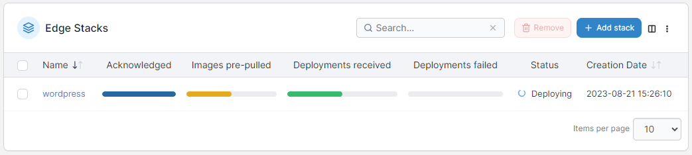<figcaption></figcaption></figure>

You can click on an individual stack's name to view the stack's details or edit the stack:

<figure>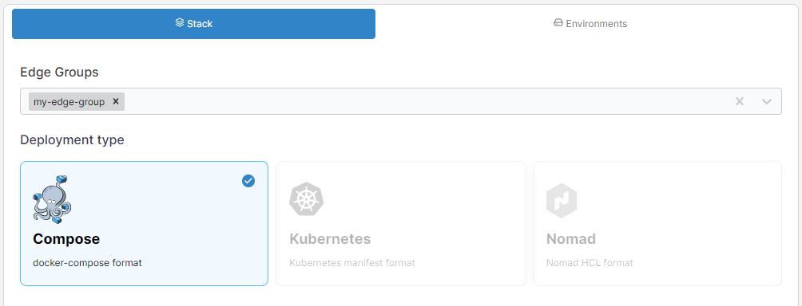<figcaption></figcaption></figure>

You can also view details about the stack's deployment across environments on the **Environments** tab.

<figure>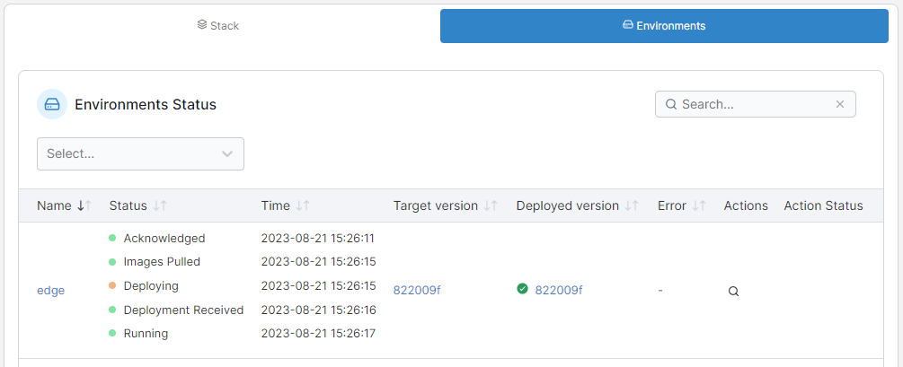<figcaption></figcaption></figure>

## Add a new stack

From the menu select **Edge Stacks** then click **Add stack**.

<figure>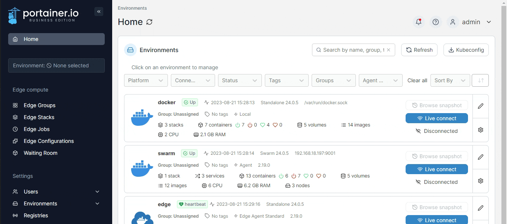<figcaption></figcaption></figure>

Give the stack a descriptive name then select one or more [Edge Groups](../groups.md).

<figure>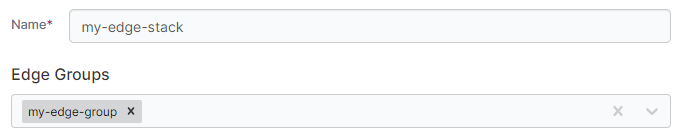<figcaption></figcaption></figure>

In **Deployment type**, select the type of deployment you are performing.


This may be auto-selected by your choice of [Edge Groups](../groups.md).


<figure>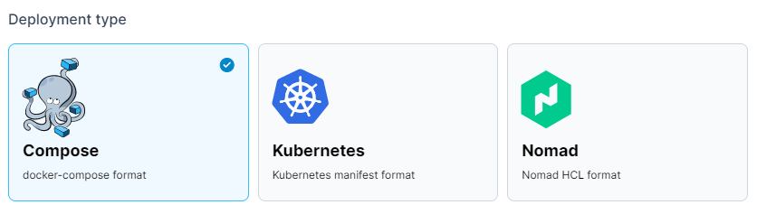<figcaption></figcaption></figure>

In the **Build Method**, define how to deploy your app from one of the following options:

| Option     | Overview                                                                        |
| ---------- | ------------------------------------------------------------------------------- |
| Web editor | Use the Portainer web editor to write or paste in your build file.              |
| Upload     | Upload a build file from your computer.                                         |
| Repository | Use a GitHub repo where the build file is stored.                               |
| Template   | Use an Edge stack template. Only available for the **Compose** deployment type. |


You can search within the web editor at any time by pressing `Ctrl-F` (or `Cmd-F` on Mac).


<figure>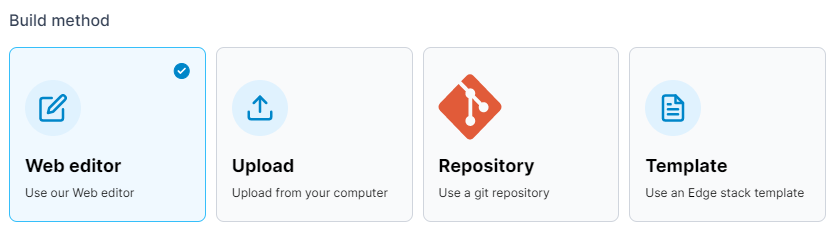<figcaption></figcaption></figure>

### Registry

If your stack requires access to images in private registries, you can specify which registry to use as part of the deployment.

<figure>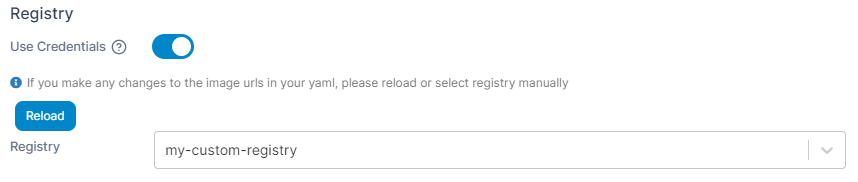<figcaption></figcaption></figure>

### Pre-pull images

By default, Docker will start containers within the stack that it already has images for, while at the same time pulling any other images it needs from the upstream registries. In some cases you may want to wait until all of the needed images are pulled to the device before starting the stack. To do this, enable the **Pre-pull images** toggle. This can also help to avoid issues when some images in a stack are unable to be pulled, leading to an incomplete or partial deployment.

<figure><figcaption></figcaption></figure>

### Retry deployment

If a deployment of an Edge Stack fails (for example if the remote Edge environment is unavailable), by default Portainer will not try and redeploy the stack. If you wish to enable retrying of failed deployments, you can toggle **Retry deployment** to on.

<figure><figcaption></figcaption></figure>

When Retry deployment is enabled for an Edge Stack and the deployment of the Edge Stack fails, Portainer will:

1. Retry the deployment every 10 seconds for the first hour.
2. After the first hour, retry once an hour for 7 days.
3. After 7 days, Portainer will stop retrying and the Edge Stack will be given a "failed" status.

### Update configurations

This section lets you define the method in which your stack updates are deployed across your Edge devices. You can choose to deploy to **All edge devices at once**, or select **Parallel edge device(s)** to specify how many devices to update concurrently.


These settings do **not** apply to the _initial_ provision of your Edge Stack. These only apply to the process that will occur when your stack is updated _after_ deployment.


<figure>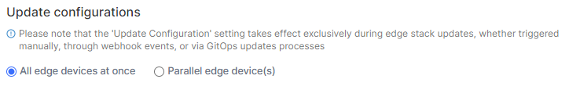<figcaption></figcaption></figure>

If **Parallel edge device(s)** is selected, you can choose to either deploy in static group sizes or in an exponential rollout strategy. For static group sizes, choose the **Number of device(s)** option and specify your group size.

<figure>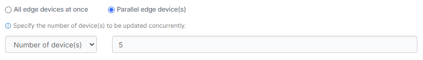<figcaption></figcaption></figure>

For an exponential rollout, choose the **Exponential rollout** option and specify how many devices to start with, then select the multiplier to apply to the initial size. For example, selecting a start size of 5 and a multiplier of 2, stack updates would be rolled out to 5 devices, then 10 (5 x 2), then 20 (10 x 2), and so forth.

<figure><figcaption></figcaption></figure>

When using parallel rollouts, you can also specify the **Timeout** (in minutes) before Portainer considers the update to have failed, as well as the **Update delay** (in minutes) between each group of updates are applied.&#x20;

In addition, you can define the **Update failure action** that will be taken if the update fails:&#x20;

* **Continue** will move on to the next group of devices to update.&#x20;
* **Pause** will halt the update process but will keep the update applied to any devices that have already been deployed to.&#x20;
* **Rollback** will halt the update process and roll back the update on devices already updated.

<figure>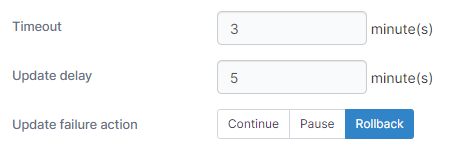<figcaption></figcaption></figure>

Once the configuration is completed, click **Deploy the stack**.
