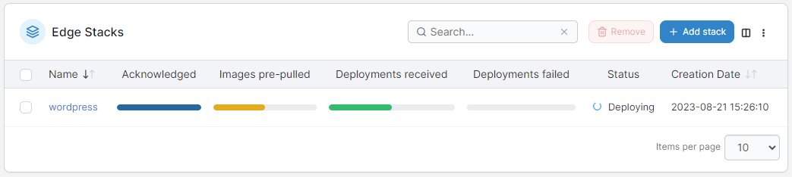
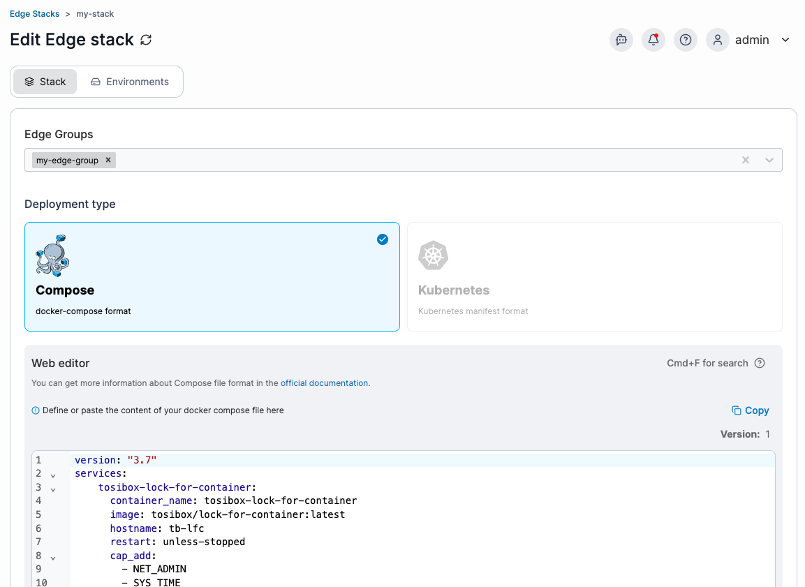
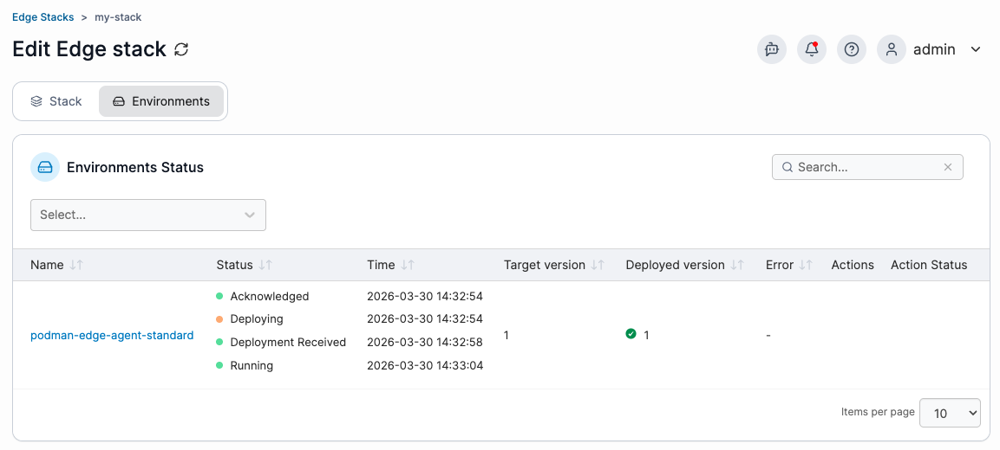

# Edge Stacks

Edge Stacks is a feature that lets you deploy applications to multiple environments from a single page, regardless of their current state.


This functionality requires you to [enable Edge Compute](../../../admin/settings/edge.md) features.


The Edge Stacks page displays a list of Edge Stacks deployed across your environments and devices and includes their name, the status of the deployment across the relevant environments (acknowledged, images pre-pulled, deployments received and failed, as well as a generic status) and the creation date. You can hover over each of the bars for more detail.

<figure><figcaption></figcaption></figure>

You can click on an individual stack's name to view the stack's details or edit the stack:

<figure><figcaption></figcaption></figure>

You can also view details about the stack's deployment across environments on the **Environments** tab.

<figure><figcaption></figcaption></figure>
