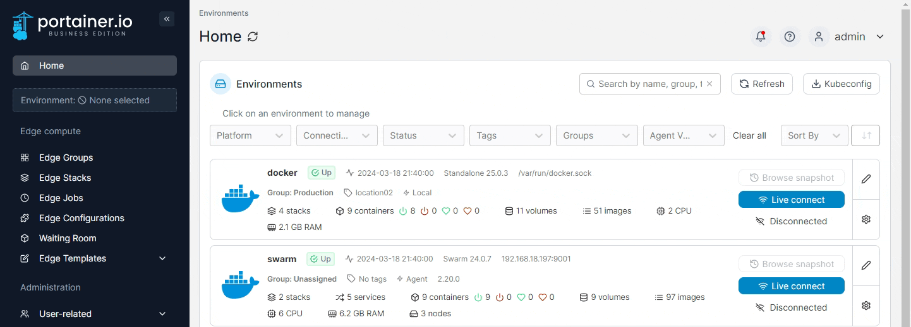
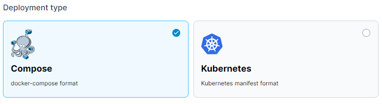
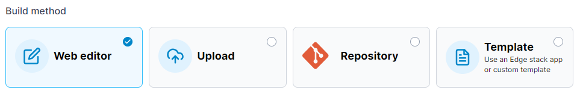
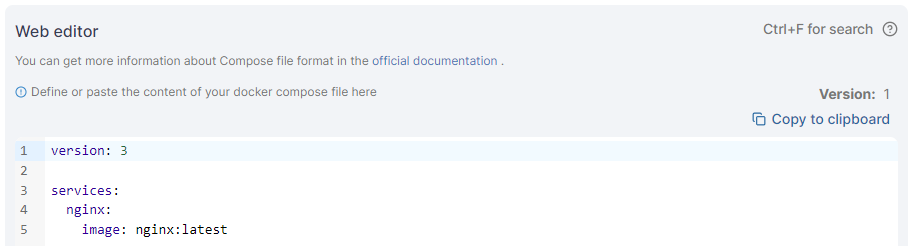
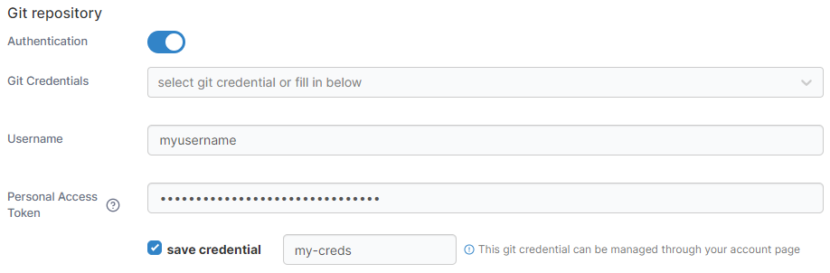
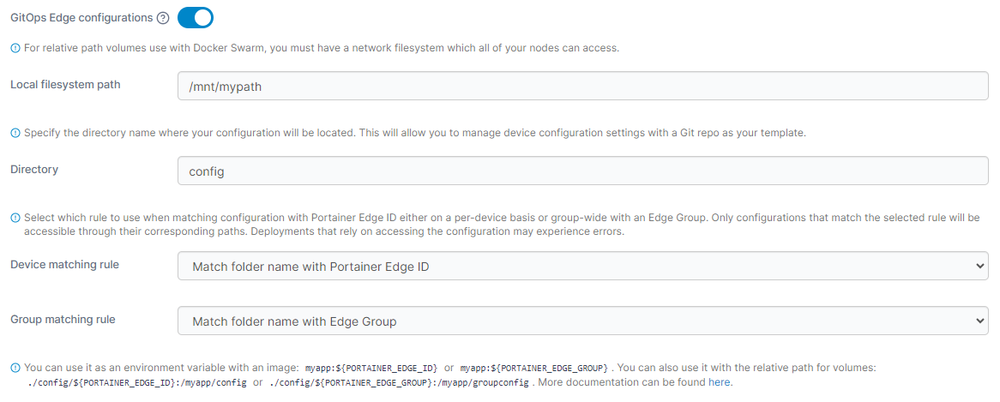
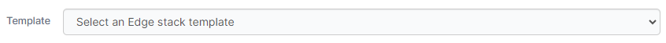
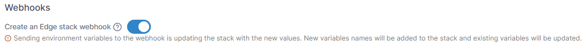

# Add a new Edge Stack

From the menu select **Edge Stacks** then click **Add stack**.

<figure><figcaption></figcaption></figure>

Give the stack a descriptive name then select one or more [Edge Groups](../groups.md).

<figure><figcaption></figcaption></figure>

In **Deployment type**, select the type of deployment you are performing.


This may be auto-selected based on the environments in your choice of [Edge Groups](../groups.md).


<figure><figcaption></figcaption></figure>

In the **Build Method**, define how to deploy your app from one of the following options:

| Option     | Overview                                                                        |
| ---------- | ------------------------------------------------------------------------------- |
| Web editor | Use the Portainer web editor to write or paste in your build file.              |
| Upload     | Upload a build file from your computer.                                         |
| Repository | Use a GitHub repo where the build file is stored.                               |
| Template   | Use an Edge stack template. Only available for the **Compose** deployment type. |

<figure><figcaption></figcaption></figure>

## Web editor

Use the web editor to define the services for your deployment.


You can search within the web editor at any time by pressing `Ctrl-F` (or `Cmd-F` on Mac).


<figure><figcaption></figcaption></figure>

## Upload

Click **Select a file** to upload a file from your computer containing your stack definition.

<figure><figcaption></figcaption></figure>

## Repository

Enter the information about your Git repository to deploy your Edge Stack from Git.


Portainer's Git deployment functionality does not currently support the use of Git submodules. If your repository includes submodules, they will not be pulled as part of the deployment. We [hope to add support](https://github.com/orgs/portainer/discussions/9767) for submodules in a future release.


| Field/Option          | Overview                                                                                                                         |
| --------------------- | -------------------------------------------------------------------------------------------------------------------------------- |
| Authentication        | Toggle this on if your Git repository requires authentication.                                                                   |
| Git Credentials       | If the **Authentication** toggle is enabled and you have configured Git credentials, you can select them from this dropdown.     |
| Username              | Enter your Git username.                                                                                                         |
| Personal Access Token | Enter your personal access token or password.                                                                                    |
| Save credential       | Check this option to save the credentials entered above for future use under the name provided in the **credential name** field. |


If you have 2FA configured in GitHub, your passcode is your password.


<figure><figcaption></figcaption></figure>

| Field/Option                 | Overview                                                                                                                                                                                          |
| ---------------------------- | ------------------------------------------------------------------------------------------------------------------------------------------------------------------------------------------------- |
| Repository URL               | Enter the repository URL. If you have enabled Authentication above the credentials will be used to access the repository. The below options will be populated by what is found in the repository. |
| Repository reference         | Select the reference to use when deploying the stack (for example, the branch).                                                                                                                   |
| Compose path / manifest path | Enter the path to the Compose or manifest file from the root of the repository.                                                                                                                   |
| Additional paths             | Click **Add file** to add additional files to be parsed by the build (for example, an environment-specific compose or manifest file).                                                             |
| GitOps updates               | Toggle this on to enable GitOps updates (see below).                                                                                                                                              |
| Skip TLS verification        | Toggle this on to skip the verification of TLS certificates used by your repository. This is useful if your repo uses a self-signed certificate.                                                  |

<figure><figcaption></figcaption></figure>

### GitOps updates

Portainer supports automatically updating your Edge Stacks deployed from Git repositories. To enable this, toggle on **GitOps updates** and configure your settings.


For more detail on how automatic updates function under the hood, have a look at [this knowledge base article](https://portal.portainer.io/knowledge/how-do-automatic-updates-for-stacks-applications-work).


| Field/Option   | Overview                                                                                                                                                                                                                                                                            |
| -------------- | ----------------------------------------------------------------------------------------------------------------------------------------------------------------------------------------------------------------------------------------------------------------------------------- |
| Mechanism      | Select the method to use when checking for updates:                                                                                                                                                                                                                                 |
|                | <p><strong>Polling:</strong> Periodically poll the Git repository from Portainer to check for updates to the repository.</p><p><strong>Webhook:</strong> Generate a webhook URL to add to your Git repository to trigger the update on demand (for example via GitHub actions).</p> |
| Fetch interval | If **Polling** is selected, how often Portainer will check the Git repository for updates.                                                                                                                                                                                          |
| Webhook        | When **Webhook** is selected, displays the webhook URL to use in your integration. Click **Copy link** to copy the webhook URL to the clipboard.                                                                                                                                    |

<figure><figcaption><p>GitOps updates when using polling</p></figcaption></figure>

<figure><figcaption><p>GitOps updates when using webhooks</p></figcaption></figure>

|                    |                                                                                                                                                                                                                                                                                                                                                                                                                                                                                                                                                             |
| ------------------ | ----------------------------------------------------------------------------------------------------------------------------------------------------------------------------------------------------------------------------------------------------------------------------------------------------------------------------------------------------------------------------------------------------------------------------------------------------------------------------------------------------------------------------------------------------------- |
| Re-pull image      | When **Webhook** is selected, displays the webhook URL to use in your integration. Click **Copy link** to copy the webhook URL to the clipboard.                                                                                                                                                                                                                                                                                                                                                                                                            |
| Force redeployment | <p>Enable this setting to force the redeployment of your stack at the specified interval (or when the webhook is triggered), overwriting any changes that have been made in the local environment, even if there has been no update to the stack in Git. This is useful if you want to ensure that your Git repository is the source of truth for your stacks and are happy with the local stack being replaced.</p><p>If this option is left disabled, automatic updates will only trigger if Portainer detects a change in the remote Git repository.</p> |

<figure><figcaption></figcaption></figure>

### Relative path volumes

When you toggle **Enable relative path volumes** to on, you are able to specify relative path references in your compose files. Portainer will create the required directory structure and populate the directories with the relevant files from your Git repository. This feature is only available for Docker Standalone and Docker Swarm environments.


If you have previously enabled [GitOps Edge configurations](add.md#gitops-edge-configurations), the filesystem path set there will be used for the relative path volumes feature as well.


On Docker Standalone environments, specify the path at which you want your files to be created on your host filesystem in the **Local filesystem path** field.


Ensure this directory exists on your local filesystem and is writable.


<figure><figcaption></figcaption></figure>

On Docker Swarm environments, specify the path at which you want your files to be created in the **Network filesystem path** field.


Ensure that this path is available on all of your Docker Swarm nodes and is writable.


<figure><figcaption></figcaption></figure>


For more detail on how this feature works, have a look at [this article](../../../advanced/relative-paths.md).


### GitOps Edge configurations

You can also choose to deploy device-specific configurations from your Git repository to the devices your Edge stack will be deployed to. To use this, enable the **GitOps Edge configurations** toggle, enter the **Local** or **Remote filesystem path**, **Directory** (relative to the root of your Git repository) and select the **Device** or **Group matching rule** that corresponds to your configuration.


If you have previously enabled [Relative path volumes](add.md#relative-path-volumes), the filesystem path set there will be used for the GitOps Edge configurations feature as well.


<figure><figcaption></figcaption></figure>


If you set both a **Device matching rule** and a **Group matching rule**, the Device matching rule will take precedence. If the Device matching rule cannot be matched (in other words, if a file or folder name matching the device name is then unable to be located), Portainer will fall back to the Group matching rule instead.


Within your Git repository at the **Directory** you define, you should have file names or folder names (depending on your **Matching rule** selection) that correspond to the Portainer Edge IDs or Edge Group for the devices you will be deploying the stack to. You can reference this ID in your stack files with the `PORTAINER_EDGE_ID` and `PORTAINER_EDGE_GROUP` environment variables.&#x20;


You can find the Edge IDs for your Edge environments under **Environments**, select the environment, and note the **Edge identifier** value in the **Edge information** box. It will look like the following:

`73149964-56f4-473b-81b3-5ecdc397e490`


For example, when using folder name matching and a directory of `config` , you can use the following syntax:

```
version: '3'

services:
  myservice:
    image: myimage:latest
    volumes:
      - ./config/${PORTAINER_EDGE_ID}:/my-device-config
```

In this example, each Edge device the stack was deployed to would mount their specific device (based on the Portainer Edge ID) folder from within the `config` directory of the Git repository to the `/my-device-config` folder in the container.

If you deploy your stack to a device that does not have a file or folder with the corresponding Portainer Edge ID in the GitOps Edge configuration directory, the stack will deploy as normal but with no device specific configuration deployed.

## Template

Select an Edge Stack template to deploy from the **Template** dropdown, and make any configuration adjustments as required.

<figure><figcaption></figcaption></figure>

## Additional settings

### Webhooks

For the Web editor, Upload and Template build methods you can choose to enable an Edge Stack webhook. This webhook will allow you to trigger updates to the stack by sending a POST request to a specific URL, instructing Portainer to pull the most up to date version of the associated image and re-deploy the stack.


For Git deployed stacks, this functionality is available via [GitOps updates](add.md#gitops-updates).


<figure><figcaption></figcaption></figure>

### Environment variables

As an optional step, you can also set environment variables. You can use these to define values in your compose file that would vary between deployments (for example, hostnames, database names, etc).


This feature is only available on Docker Standalone and Docker Swarm environments.


Environment variables can be set individually within Portainer or you can use **Load variables from .env file** to upload a file containing your environment variables. Environment variables you define (either individually or via a .env file) will be available to use in your compose file using an `environment` definition:

```
environment:
  MY_ENVIRONMENT_VARIABLE: ${MY_ENVIRONMENT_VARIABLE}
```

Alternatively, you can add `stack.env` as an `env_file` definition to add all the environment variables that you have defined individually as well as those included in an uploaded .env file:

```
env_file:
  - stack.env
```


Note the compose file is not changed when environment variables are used - this allows variables to be updated within Portainer without editing the compose file itself which would take it out of sync with the Git repository. You will still see the `${MY_ENVIRONMENT_VARIABLE}` style entry in the compose file.


<figure><figcaption></figcaption></figure>

### Registry

If your stack requires access to images in private registries, you can specify which registry to use as part of the deployment.

<figure><figcaption></figcaption></figure>

### Pre-pull images

By default, Docker will start containers within the stack that it already has images for, while at the same time pulling any other images it needs from the upstream registries. In some cases you may want to wait until all of the needed images are pulled to the device before starting the stack. To do this, enable the **Pre-pull images** toggle. This can also help to avoid issues when some images in a stack are unable to be pulled, leading to an incomplete or partial deployment.

<figure><figcaption></figcaption></figure>

### Retry deployment

If a deployment of an Edge Stack fails (for example if the remote Edge environment is unavailable), by default Portainer will not try and redeploy the stack. If you wish to enable retrying of failed deployments, you can toggle **Retry deployment** to on.

<figure><figcaption></figcaption></figure>

When Retry deployment is enabled for an Edge Stack and the deployment of the Edge Stack fails, Portainer will:

1. Retry the deployment every 10 seconds for the first hour.
2. After the first hour, retry once an hour for 7 days.
3. After 7 days, Portainer will stop retrying and the Edge Stack will be given a "failed" status.

### Update configurations

This section lets you define the method in which your stack updates are deployed across your Edge devices. You can choose to deploy to **All edge devices at once**, or select **Parallel edge device(s)** to specify how many devices to update concurrently.


These settings do **not** apply to the _initial_ provision of your Edge Stack. These only apply to the process that will occur when your stack is updated _after_ deployment.


<figure><figcaption></figcaption></figure>

If **Parallel edge device(s)** is selected, you can choose to either deploy in static group sizes or in an exponential rollout strategy. For static group sizes, choose the **Number of device(s)** option and specify your group size.

<figure><figcaption></figcaption></figure>

For an exponential rollout, choose the **Exponential rollout** option and specify how many devices to start with, then select the multiplier to apply to the initial size. For example, selecting a start size of 5 and a multiplier of 2, stack updates would be rolled out to 5 devices, then 10 (5 x 2), then 20 (10 x 2), and so forth.

<figure><figcaption></figcaption></figure>

When using parallel rollouts, you can also specify the **Timeout** (in minutes) before Portainer considers the update to have failed, as well as the **Update delay** (in minutes) between each group of updates are applied.&#x20;

In addition, you can define the **Update failure action** that will be taken if the update fails:&#x20;

* **Continue** will move on to the next group of devices to update.&#x20;
* **Pause** will halt the update process but will keep the update applied to any devices that have already been deployed to.&#x20;
* **Rollback** will halt the update process and roll back the update on devices already updated.

<figure><figcaption></figcaption></figure>

Once the configuration is completed, click **Deploy the stack**.
