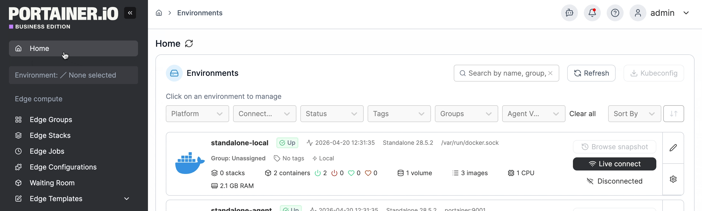
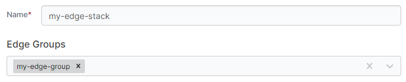
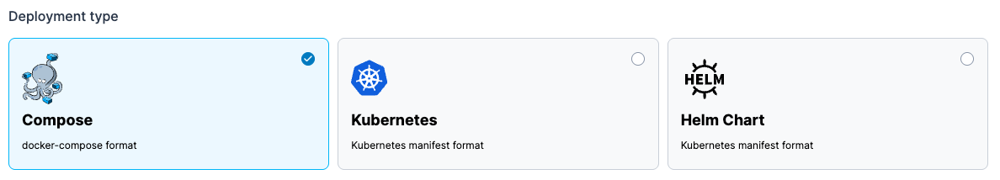

---
metaLinks:
  alternates:
    - https://app.gitbook.com/s/MdgxA76kWxcRmwybM8Ft/user/edge/stacks/add
---

# Add a new Edge Stack

From the menu select **Edge Stacks** then click **Add stack**.

<figure><figcaption></figcaption></figure>

Give the stack a descriptive name then select one or more [Edge Groups](../../groups.md).

<figure><figcaption></figcaption></figure>

In **Deployment type**, select the type of deployment you are performing.


This may be auto-selected based on the environments in your choice of [Edge Groups](../../groups.md).


<figure><figcaption></figcaption></figure>

Next, define how to deploy your app from one of the **Build Method** options. These options will differ based on your selected development type.


[compose-deployment.md](compose-deployment.md)



[kubernetes-deployment.md](kubernetes-deployment.md)



[helm-chart-deployment.md](helm-chart-deployment.md)

