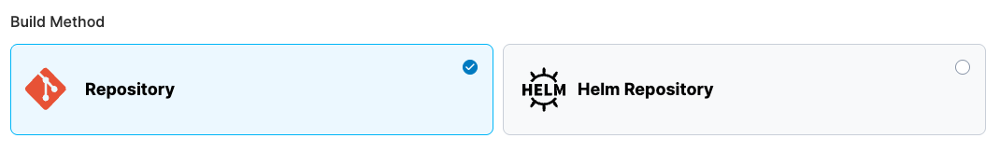
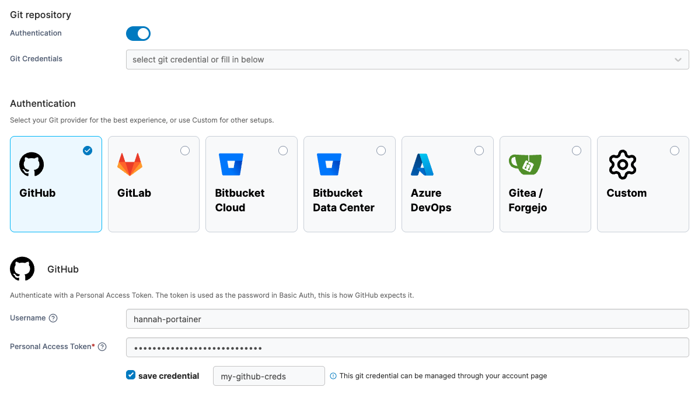
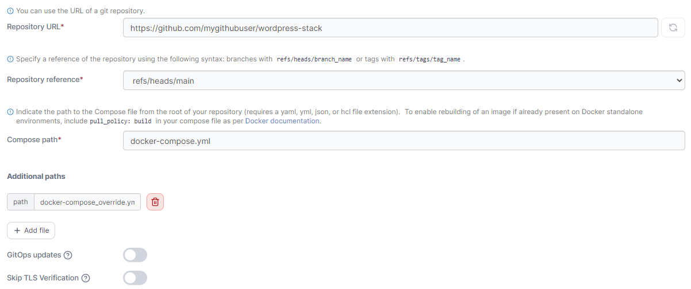
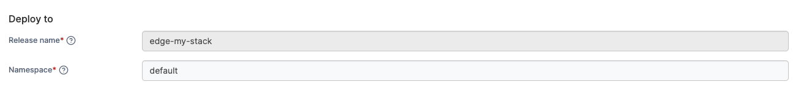
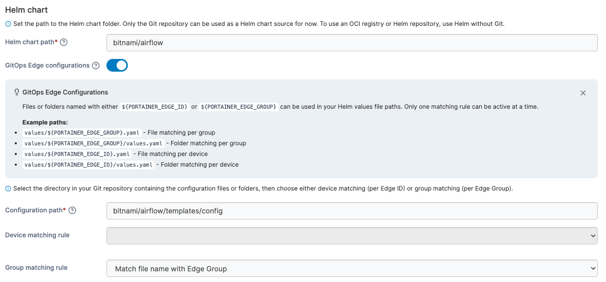
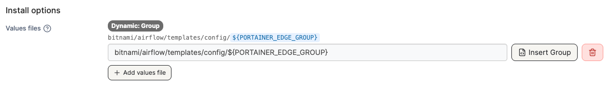
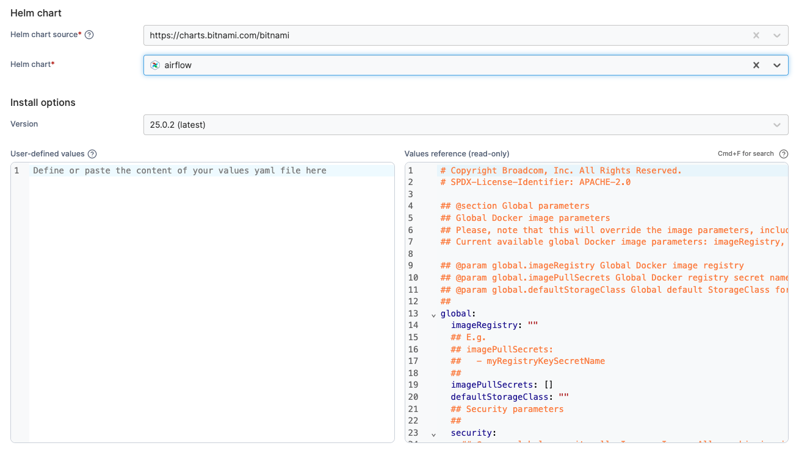

# Helm chart deployment

Define how to deploy your app from one of the **Build Method** options.&#x20;

| Option                                                      | Overview                                                                                                                                                          |
| ----------------------------------------------------------- | ----------------------------------------------------------------------------------------------------------------------------------------------------------------- |
| [Repository](helm-chart-deployment.md#repository)           | Use a GitHub repo where the build file is stored.                                                                                                                 |
| [Helm Repository](helm-chart-deployment.md#helm-repository) | Point Portainer at any accessible Helm chart repository, browse the available charts, and deploy directly from it without needing to manage chart files manually. |

<figure><figcaption></figcaption></figure>

### Repository

Enter the information about your Git repository to deploy your Edge Stack from Git.


Portainer's Git deployment functionality does not currently support the use of Git submodules. If your repository includes submodules, they will not be pulled as part of the deployment. We [hope to add support](https://github.com/orgs/portainer/discussions/9767) for submodules in a future release.


| Field/Option          | Overview                                                                                                                                                                                                                                                                                                                                                                                                                     |
| --------------------- | ---------------------------------------------------------------------------------------------------------------------------------------------------------------------------------------------------------------------------------------------------------------------------------------------------------------------------------------------------------------------------------------------------------------------------- |
| Authentication        | Toggle this on if your Git repository requires authentication.                                                                                                                                                                                                                                                                                                                                                               |
| Git Credentials       | If the **Authentication** toggle is enabled and you have configured [individual](../../../account-settings.md#git-credentials) or [shared](../../../../admin/settings/credentials/git.md) Git credentials, you can select them from this dropdown. Shared Git credentials can be identified with the **Shared** tag, and are only available to administrators at present. Leave this field unset to provide new credentials. |
| Username              | Enter your Git username.                                                                                                                                                                                                                                                                                                                                                                                                     |
| Personal Access Token | 
Enter your personal access token or password. Ensure your token has repository read permissions. See the <a href="../../../../faqs/getting-started/what-scopes-are-required-for-github-gitlab-and-bitbucket-tokens.md">Git authentication token permissions FAQ</a>.
                                                                                                                                               |
| Save credential       | Check this option to save the credentials entered above for future use under the name provided in the **credential name** field.                                                                                                                                                                                                                                                                                             |


If you have 2FA configured in GitHub, your passcode is your password.


<figure><figcaption></figcaption></figure>

| Field/Option          | Overview                                                                                                                                                                                          |
| --------------------- | ------------------------------------------------------------------------------------------------------------------------------------------------------------------------------------------------- |
| Repository URL        | Enter the repository URL. If you have enabled Authentication above the credentials will be used to access the repository. The below options will be populated by what is found in the repository. |
| Skip TLS verification | Toggle this on to skip the verification of TLS certificates used by your repository. This is useful if your repo uses a self-signed certificate.                                                  |
| Repository reference  | Select the reference to use when deploying the stack (for example, the branch).                                                                                                                   |
| GitOps updates        | Toggle this on to enable GitOps updates (see below).                                                                                                                                              |

<figure><figcaption></figcaption></figure>

#### GitOps updates


This feature is only available in [Portainer Business Edition](https://www.portainer.io/business-upsell?from=ca-file).


Portainer supports automatically updating your Edge Stacks deployed from Git repositories. To enable this, toggle on **GitOps updates** and configure your settings.


For more detail on how automatic updates function under the hood, have a look at [this FAQ](../../../../faqs/troubleshooting/stacks-deployments-and-updates/how-do-automatic-updates-for-stacks-applications-work.md).


| Field/Option   | Overview                                                                                                                                                                                                                                                                                                                                      |
| -------------- | --------------------------------------------------------------------------------------------------------------------------------------------------------------------------------------------------------------------------------------------------------------------------------------------------------------------------------------------- |
| Mechanism      | 
Select the method to use when checking for updates:

<strong>Polling:</strong> Periodically poll the Git repository from Portainer to check for updates to the repository.

<strong>Webhook:</strong> Generate a webhook URL to add to your Git repository to trigger the update on demand (for example via GitHub actions).
 |
| Fetch interval | If **Polling** is selected, how often Portainer will check the Git repository for updates.                                                                                                                                                                                                                                                    |
| Webhook        | When **Webhook** is selected, displays the webhook URL to use in your integration. Click **Copy link** to copy the webhook URL to the clipboard.                                                                                                                                                                                              |

<figure><figcaption>
GitOps updates when using polling
</figcaption></figure>

<figure><figcaption>
GitOps updates when using webhooks
</figcaption></figure>

|                    |                                                                                                                                                                                                                                                                                                                                                                                                                                                                                                                                                             |
| ------------------ | ----------------------------------------------------------------------------------------------------------------------------------------------------------------------------------------------------------------------------------------------------------------------------------------------------------------------------------------------------------------------------------------------------------------------------------------------------------------------------------------------------------------------------------------------------------- |
| Re-pull image      | When enabled, Portainer checks for an updated image when a redeploy is triggered via webhook or polling. It uses the tag you configured; if no tag is set, or you set `latest`, it uses `latest`. If that tag now points to a new image, Portainer pulls it and redeploys the workload.                                                                                                                                                                                                                                                                     |
| Force redeployment | 
Enable this setting to force the redeployment of your stack at the specified interval (or when the webhook is triggered), overwriting any changes that have been made in the local environment, even if there has been no update to the stack in Git. This is useful if you want to ensure that your Git repository is the source of truth for your stacks and are happy with the local stack being replaced.

If this option is left disabled, automatic updates will only trigger if Portainer detects a change in the remote Git repository.
 |

<figure><figcaption></figcaption></figure>

#### Deploy to

When deploying using a Helm repository, the **Release name** will be automatically generated based on the stack name given above. Specify a **Namespace**.

#### Helm chart

<figure><figcaption></figcaption></figure>

Next, specify the path to the Helm chart folder from the root of your repository. The folder must contain a Chart.yaml file.

Toggle on **GitOps Edge Configurations** in able to use dynamic variables in your Helm values file paths. When enabled, Portainer will automatically fetch the content from your git repository by matching the folder name or file name with the Portainer Edge ID or Edge Group name, and apply it to the environment where the stack is deployed. Specify the **configuration path** and a device matching rule or a group matching rule from the drop down selectors.&#x20;

<figure><figcaption></figcaption></figure>

#### Install options&#x20;

Optionally specify any **values files** to override the default chart values. If multiple values files are specified, they will be merged in the order they are added and therefore the last values file takes precedence.

You can get more information about the Helm values file format in the [official Helm documentation](https://helm.sh/docs/chart_template_guide/values_files/).

<figure><figcaption></figcaption></figure>

### Helm Repository&#x20;

When deploying using a Helm repository, the **Release name** will be automatically generated based on the stack name given above. Begin your configuration by specifying a **Namespace**.

<figure><figcaption></figcaption></figure>

Next, select a **Helm chart source** from the dropdown. Portainer will retrieve the available charts from the selected registry and display them in the list below. Use the search bar or filter by category to find the chart you need, then select it.


When a Helm chart source is selected for the first time, it may take a moment to download and populate the chart list.


Once a chart is selected, Portainer will automatically import the `values.yaml` file for the latest chart version, displaying it in the right-hand pane for reference. Use the left-hand pane to make any necessary customizations. To deploy a different version, select it from the **Version** dropdown.

<figure><figcaption></figcaption></figure>

## Additional settings

### Install options

Optionally specify the following for your deployment:

* **Rollback on failure** - Toggle on to automatically roll back the release if the deployment fails.
* **Timeout** - Set the maximum time allowed for Helm operations to complete. Leave blank for the default timeout to be applied.

### Update configurations


This feature is only available in [Portainer Business Edition](https://www.portainer.io/business-upsell?from=ca-file).


This section lets you define the method in which your stack updates are deployed across your Edge devices. You can choose to deploy to **All edge devices at once**, or select **Parallel edge device(s)** to specify how many devices to update concurrently.


These settings do **not** apply to the _initial_ provision of your Edge Stack. These only apply to the process that will occur when your stack is updated _after_ deployment.


<figure><figcaption></figcaption></figure>

If **Parallel edge device(s)** is selected, you can choose to either deploy in static group sizes or in an exponential rollout strategy. For static group sizes, choose the **Number of device(s)** option and specify your group size.

<figure><figcaption></figcaption></figure>

For an exponential rollout, choose the **Exponential rollout** option and specify how many devices to start with, then select the multiplier to apply to the initial size. For example, selecting a start size of 5 and a multiplier of 2, stack updates would be rolled out to 5 devices, then 10 (5 x 2), then 20 (10 x 2), and so forth.

<figure><figcaption></figcaption></figure>

When using parallel rollouts, you can also specify the **Timeout** (in minutes) before Portainer considers the update to have failed, as well as the **Update delay** (in minutes) between each group of updates are applied.&#x20;

In addition, you can define the **Update failure action** that will be taken if the update fails:&#x20;

* **Continue** will move on to the next group of devices to update.&#x20;
* **Pause** will halt the update process but will keep the update applied to any devices that have already been deployed to.&#x20;
* **Rollback** will halt the update process and roll back the update on devices already updated.

<figure><figcaption></figcaption></figure>

Once the configuration is completed, click **Deploy the stack**.
