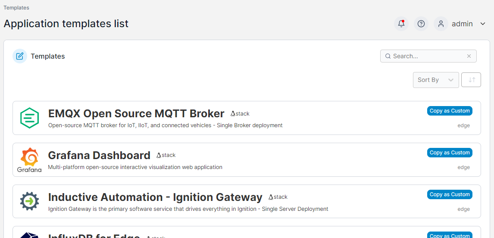

# Application

This section lists the application templates that are available to be deployed on your Edge devices.

<figure><figcaption></figcaption></figure>

To create an Edge stack from a template, click the template in the list. You will be taken to the [Edge Stack creation page](../stacks/add.md) with the template pre-filled.

If you want to create your own [custom template](../../docker/templates/custom.md) based on an existing application template, click **Copy as Custom**.
