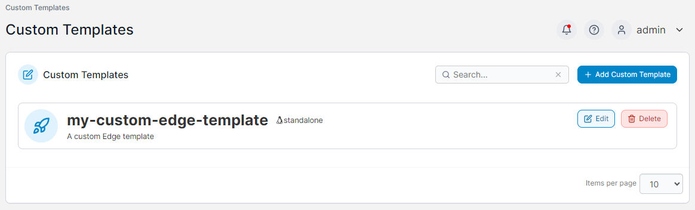
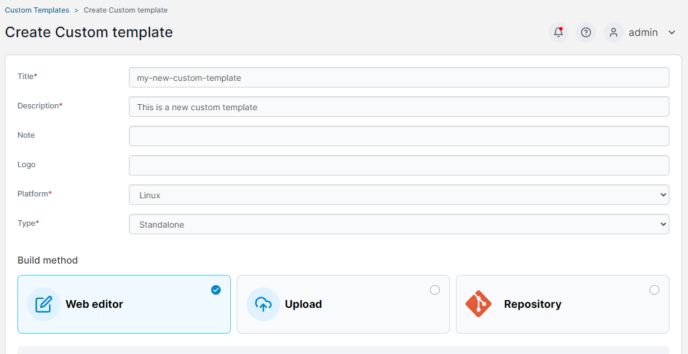
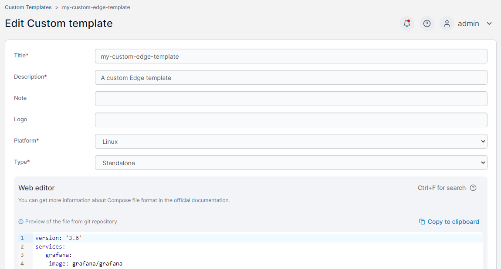

# Custom

This section lists the custom templates that have been created for deploying to your Edge devices.

<figure><figcaption></figcaption></figure>

To deploy a custom template as an Edge stack, click the template in the list.

## Add a new custom template

To create a new custom template, click the **Add Custom Template** button and fill out the resulting form and stack details.


For more detail on custom template creation, refer to the [custom template](../../docker/templates/custom.md#creating-a-new-custom-template) documentation.


<figure><figcaption></figcaption></figure>

## Edit an existing template

To edit an existing custom template, click the **Edit** button for the template you want to change.&#x20;

<figure><figcaption></figcaption></figure>

## Remove a custom template

To remove a custom template, click the **Delete** button for the template you want to remove. This will not remove any Edge stacks that had been previously created with this template.&#x20;
