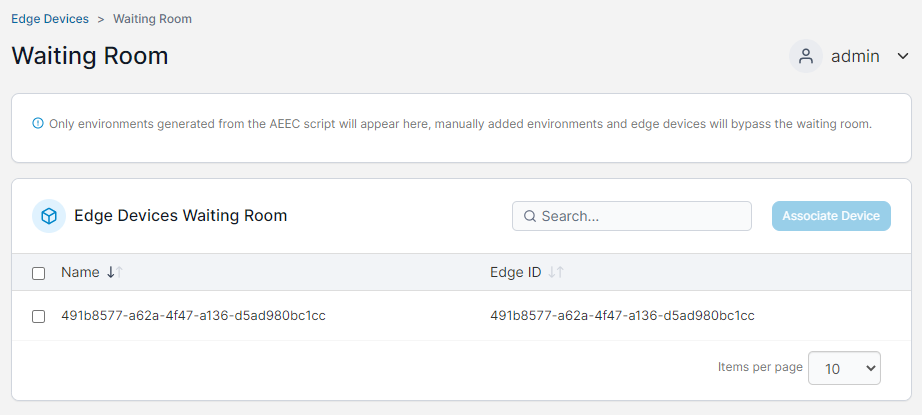

# Waiting Room

The Edge Devices Waiting room lists any Edge Devices that have connected using the pre-deploy script and are pending association with the Portainer instance.

<figure><figcaption></figcaption></figure>

To associate a device with your Portainer instance, tick the box next to the device and click **Associate Device**.
