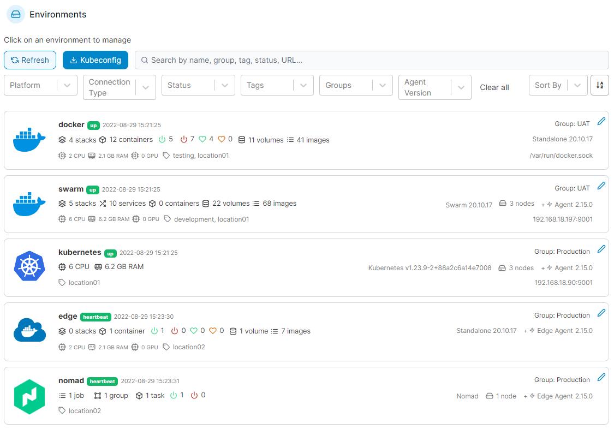
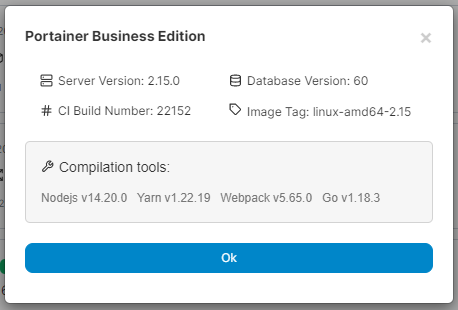
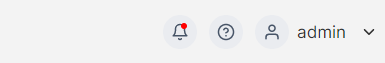

# Home

The **Home** page is the first page you will see after logging into Portainer. This page provides an overview of your environments along with vital statistics about each. You can search and filter your list of environments using the options at the top of the list.

To manage an environment, click to select it.

<figure><figcaption></figcaption></figure>

## Build information

You can view the build information for your Portainer installation by clicking on the Portainer version number in the bottom left of the UI. This may be helpful when troubleshooting issues with the Portainer support team.

<figure><figcaption></figcaption></figure>

In the box that appears you can see the server version, database version, build number and image tag, as well as the versions of the compilation tools used to build Portainer.&#x20;

## Context-sensitive help

From any page in the Portainer UI, you can click on the question mark icon in the top right next to your username to access the related section of this documentation.&#x20;

<figure><figcaption></figcaption></figure>
