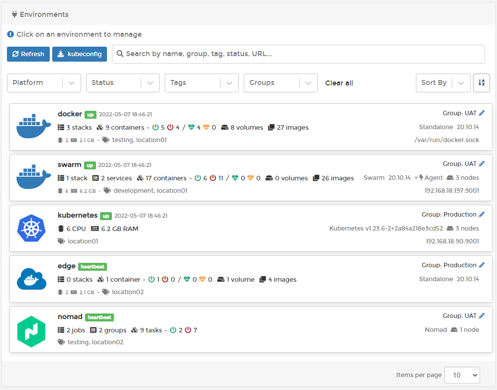

# Home

The **Home** page is the first page you will see after logging into Portainer. This page provides an overview of your environments along with vital statistics about each. You can search and filter your list of environments using the options at the top of the list.

To manage an environment, click to select it.

