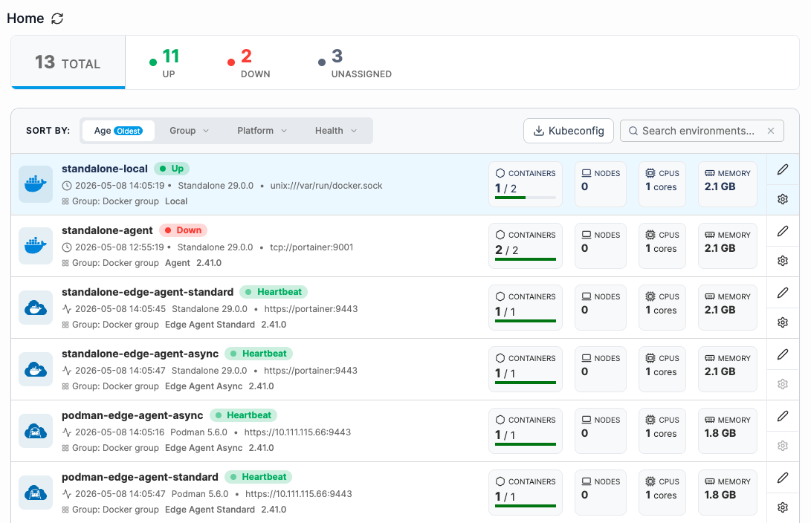
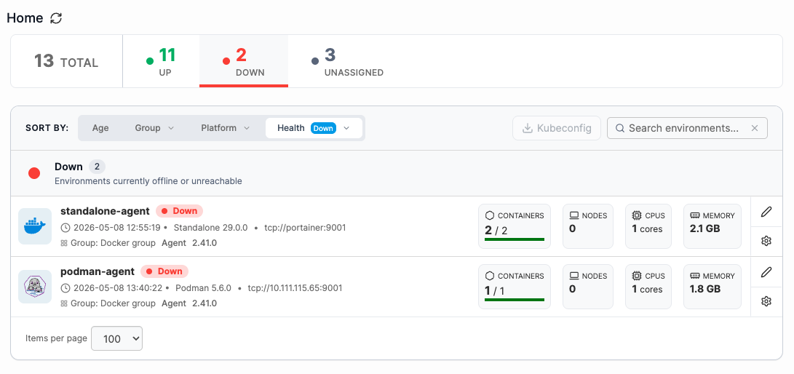
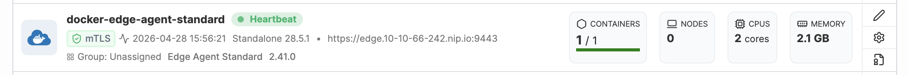
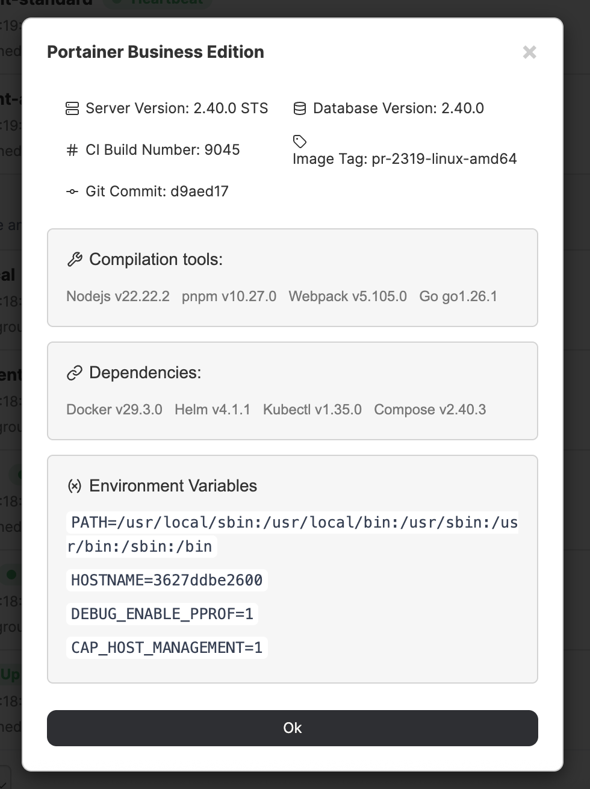
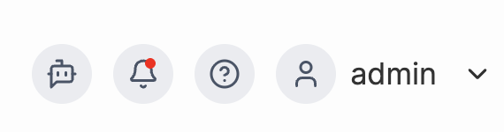

---
metaLinks:
  alternates:
    - https://app.gitbook.com/s/Dalese9Lv4CX6YKS1s45/user/home
---

# Home

The Home page is the first page you will see after logging into Portainer. It provides a grouped, card-based view of your environments with at-a-glance health and performance metrics.&#x20;

<figure><figcaption></figcaption></figure>

A header bar above the environment list shows a live breakdown of your fleet by health, calling out any environments that are **unassigned** and therefore do not belong to a group. Clicking any of these segments filters the list, replacing any existing filter or grouping.&#x20;

Environments are sorted by age by default; clicking the **Age** option toggles between newest and oldest. You can also filter your environment list by **Group**, **Platform**, or **Health**. You can search for specific environments by name, which will filter the list by your search term. If your list includes Kubernetes environments, you can also download a combined [Kubeconfig](../kubernetes/kubeconfig.md) file from this panel.

<figure><figcaption></figcaption></figure>

Each environment is displayed as a card showing the metrics most relevant to that environment type:

* **Containers count** - shown for Docker host environments
* **Nodes count** - shown for Kubernetes and Docker Swarm environments
* **CPU and memory usage -** shown for all environment types
* **Status badge** - displayed next to the environment name; shows **Up/Down** for standard agents and **Heartbeat/Down** for Edge agents

<figure><figcaption></figcaption></figure>

To open an environment, click its card. Click the pencil icon to edit the environment's connection configuration, the cog button to go to the environment's settings page (only available if the environment is directly accessible), and the certificate icon to view the mTLS certificate (if applicable).

## Build information

You can view the build information for your Portainer installation by clicking on the Portainer version number in the bottom left of the UI. This may be helpful when troubleshooting issues with the Portainer support team.

<figure><figcaption></figcaption></figure>

In the box that appears you can see the server version, database version, build number, image tag, and Git commit, as well as the versions of the compilation tools, dependencies, and environment variables used to build Portainer.

## Getting help

From any page in the Portainer UI, you can click on the **question mark icon** in the top right next to your username to access the related section of this documentation. You can also click the **robot icon** to start a conversation with our [AI chatbot](https://portainer.io/ask-the-ai).

<figure><figcaption></figcaption></figure>
