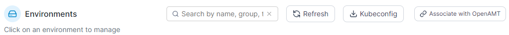
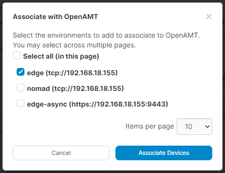

# OpenAMT

OpenAMT allows you to remotely manage your compatible Edge devices from Portainer, letting you start, stop, restart and access the device console directly from within the Portainer UI.

## Preparation

To associate an Edge device with OpenAMT you must first add a compatible device. To do this, first [deploy the Edge Agent](../../admin/environments/add/) to your device based on the appropriate method for your environment type.

Once the Edge Agent has been set up and deployed on the remote device, the device is ready to be associated with OpenAMT.

## Associate your device

To associate an existing Edge Agent deployment with OpenAMT, from the Home page click the **Associate with OpenAMT** button.&#x20;

<figure><figcaption></figcaption></figure>

Check the box next to the device(s) you want to associate, then click the **Associate Devices** button. The activation process will now begin.

<figure><figcaption></figcaption></figure>

Once activation completes you will be returned to the Home page.&#x20;

## Interact with your device

Once an OpenAMT device has been associated with an Edge Device in Portainer, you are able to interact directly with that device. To do so, go to the Home page and use the options on the right hand side of the tile to interact as required.

* **Power ON**: Will power on the device if it is currently switched off.
* **Power OFF**: Will power off the device if it is currently switched on.
* **Restart**: Will initiate a restart of the device.
* **KVM**: Will open a remote KVM (keyboard, video, mouse) session with the device.
