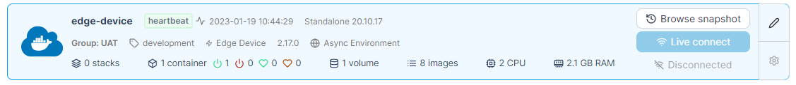
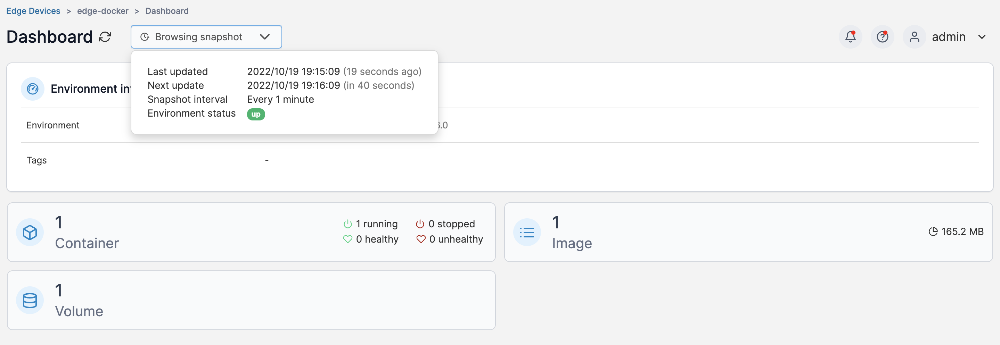
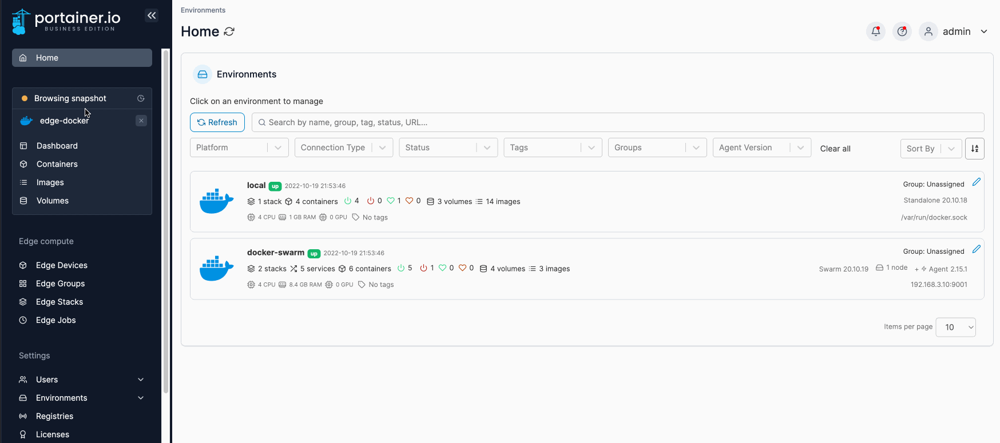

# Snapshot browsing

Snapshot browsing allows the ability to run remote commands on your Edge devices that are in Async mode. You can browse your device as well as run commands like start, stop, restart, and delete on your containers, stacks and volumes.

To browse your Edge device, on the [home page](./) locate your Edge device and click the **Browse snapshot** button.

<figure><figcaption></figcaption></figure>

You will be directed to the dashboard for the Edge device, with a **Browsing snapshot** drop down that details the last updated and next updated date, how often the snapshots are taken and the environment status.  You can refer to the [deployment sync options ](../../admin/settings/edge.md#deployment-sync-options)for more details.&#x20;


The information displayed in Portainer for your Edge device is up to date as of the time the latest snapshot (as indicated in the dropdown) was taken. Depending on the [age of the snapshot](../../admin/settings/edge.md#deployment-sync-options) and the environment, this may not be an up to date representation of the current state of the device, so bear this in mind when taking actions on the device.


<figure><figcaption></figcaption></figure>

From here, you can browse the device as you would a regular environment.

<figure><figcaption></figcaption></figure>

a
