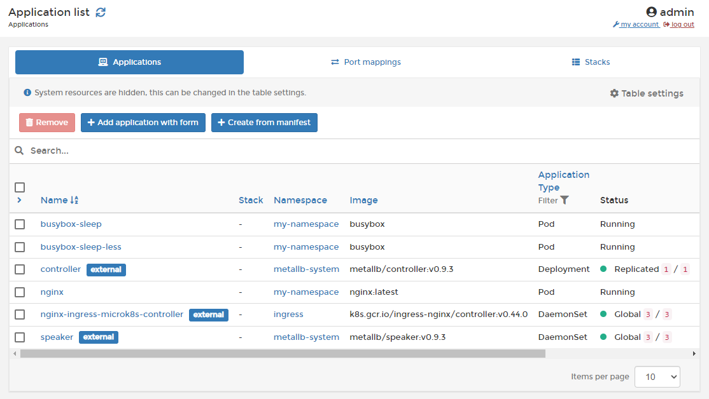

# Applications

In Kubernetes, an application is a collection of configuration settings and variables required to run your app. This may consist of a single container or multiple containers with complex interoperability.

Portainer lets you add applications either manually or through a manifest:


[add.md](add.md)



[manifest.md](manifest.md)


You can also inspect a running application:


[inspect.md](inspect.md)


Version 2.9 has added support for deploying applications via [Helm](../helm/) charts:


[deploy.md](../helm/deploy.md)


If you no longer require an application, it can be removed:


[remove.md](remove.md)

