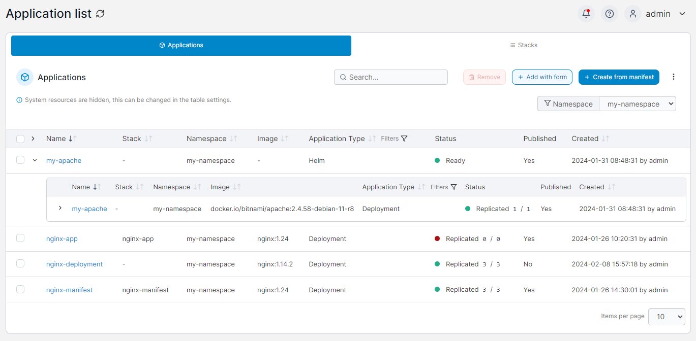

# Applications

In Kubernetes, an application is a collection of configuration settings and variables required to run your app. This may consist of a single container or multiple containers with complex interoperability.

<figure><figcaption></figcaption></figure>

You can filter the list of applications by namespace using the **Namespace** dropdown.

Portainer lets you add applications either using a form or through a manifest:


[add.md](add.md)



[manifest.md](manifest.md)


You can also inspect a running application:


[inspect.md](inspect.md)



[inspect-helm.md](inspect-helm.md)


Applications can be edited, webhooks can be configured and volumes can be detached:


[edit.md](edit.md)



[webhooks.md](webhooks.md)



[detach-volume.md](detach-volume.md)


If you no longer require an application, it can be removed:


[remove.md](remove.md)

