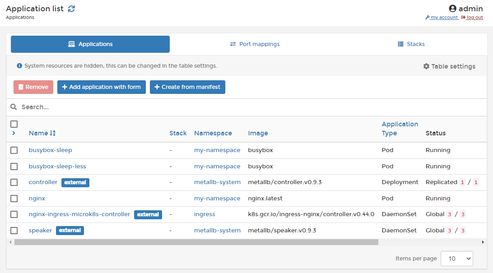

# Applications

In Kubernetes, an application is a collection of configuration settings and variables required to run your app. This may consist of a single container or multiple containers with complex interoperability.

Portainer lets you add applications either manually or through a manifest:





You can also inspect a running application:



Version 2.9 has added support for deploying applications via [Helm](../helm/) charts:



If you no longer require an application, it can be removed:



