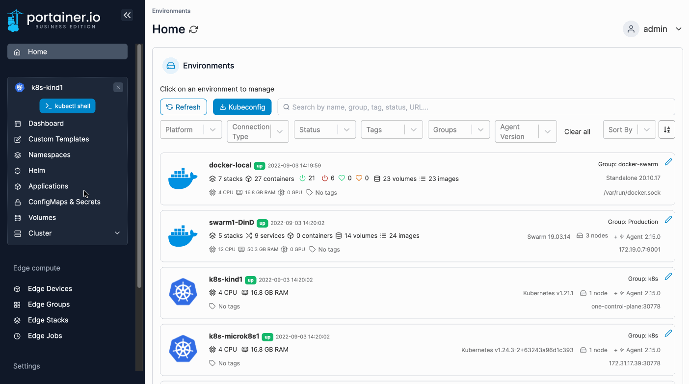
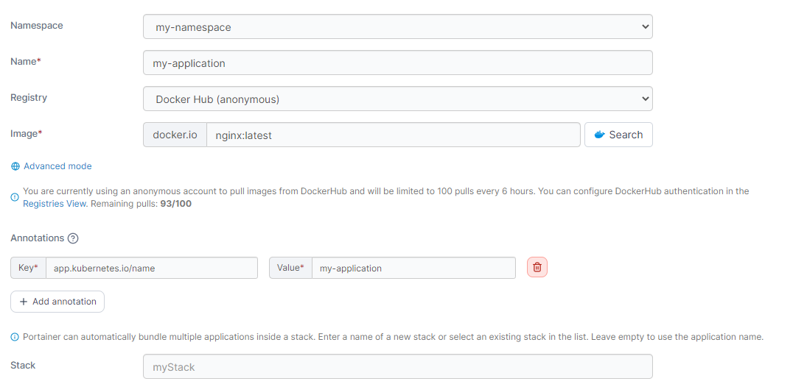
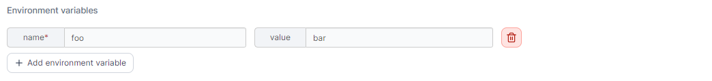
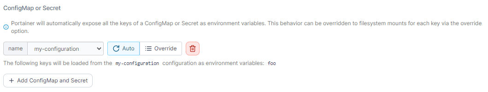
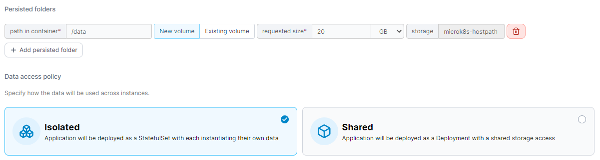
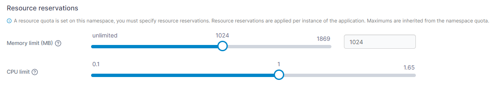
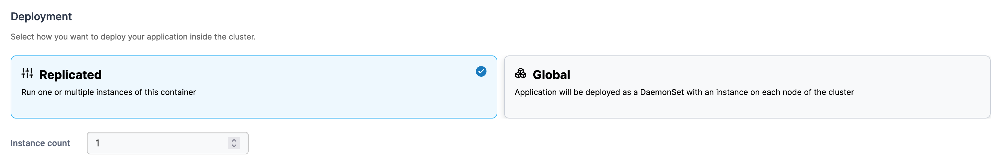
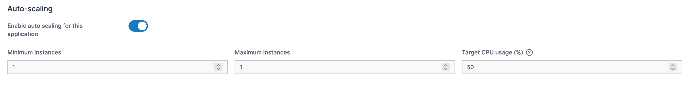
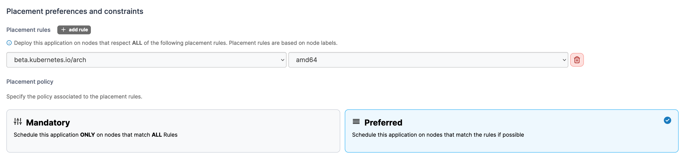
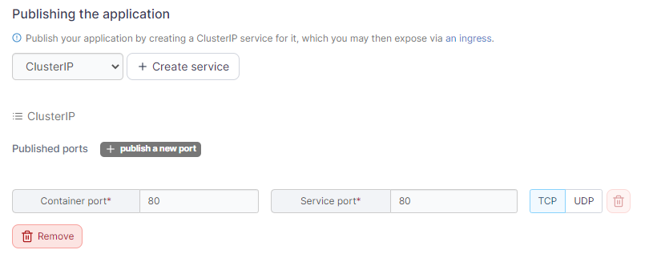

# Add a new application using a form

There are two ways to add a new application: manually by using a form or automatically by [using a manifest](manifest.md). This article explains how to add an application manually.

From the menu select **Applications** then click **Add with form**.

<figure><figcaption></figcaption></figure>

Complete the required information, using the sections below as a guide.

### Base configuration

| Field/Option | Overview                                                                                                                                                                                                   |
| ------------ | ---------------------------------------------------------------------------------------------------------------------------------------------------------------------------------------------------------- |
| Namespace    | Select the namespace where the application will reside.                                                                                                                                                    |
| Name         | Give the application a descriptive name.                                                                                                                                                                   |
| Registry     | Select the registry to pull the image from. If you want to pull from a registry that is not configured with Portainer, click **Advanced mode** then enter the URL and image manually.                      |
| Image        | Enter the name (and optionally the tag) of the image that will be used to deploy the application.                                                                                                          |
| Annotations  | You can add annotations to your application as required by clicking **Add annotation** and filling in the **Key** and **Value** fields.                                                                    |
| Stack        | Portainer can automatically bundle multiple applications inside a stack. You can either enter the name of a new stack, select an existing stack from the list, or leave empty to use the application name. |

<figure><figcaption></figcaption></figure>

### Environment variables

Here you can define any environment variables you wish to be available to your application.

<figure><figcaption></figcaption></figure>

### ConfigMap or Secret

Select any ConfigMaps or secrets you have previously created to make them available to the application. Portainer will automatically expose all the keys of a ConfigMap or secret as environment variables. This behavior can be overridden to filesystem mounts for each key via the **Override** button.

<figure><figcaption></figcaption></figure>

### Persisted folders

Define any persistent folders within the application and whether these are new or existing volumes, as well as the size of the volume and storage location.

You can also define the **Data access policy** for your persisted folders:

* **Isolated:** Each instance of the application will use its own data.
* **Shared**: All application instances will use the same data.

<figure><figcaption></figcaption></figure>

### Resource reservations

In this section you can define the amount of **memory** and **CPU** available to the application. If the namespace you have selected has resource quotas set, you must define these values.

<figure><figcaption></figcaption></figure>

### Deployment

This section allows you to choose how you want to deploy the application inside the cluster. Options are:

* **Replicated:** Run one or multiple instances of this container.
* **Global:** Deploy an instance of this container on each cluster node.

You can also define the number of instances of the application to run by setting the **Instance count**.

<figure><figcaption></figcaption></figure>

### Auto-scaling

Toggle **Enable auto scaling for this application** to enable auto-scaling for the application you are deploying. This requires that the Kubernetes metrics server is installed and [enabled in the cluster setup](../cluster/setup.md#resources-and-metrics).

| Field/Option      | Overview                                                                                                                                                                                |
| ----------------- | --------------------------------------------------------------------------------------------------------------------------------------------------------------------------------------- |
| Minimum instances | Enter the minimum number of instances that you want running for this application.                                                                                                       |
| Maximum instances | Enter the maximum number of instances that you want running for this application.                                                                                                       |
| Target CPU usage  | Enter the target CPU percentage for your application. The autoscaler will ensure that enough instances are running to maintain an average CPU usage of this value across all instances. |

<figure><figcaption></figcaption></figure>

### Placement preferences and constraints

Here you can define which placement rules must be followed by the nodes where the application is deployed to. Placement rules are based on node labels. To create a new rule, click **add rule**.

You can also define the placement policy for the rules you have set. Options are:

* **Mandatory:** The application will only be scheduled on nodes that follow all rules.
* **Preferred**: If possible, the application will be scheduled on nodes that follow all rules.

<figure><figcaption></figcaption></figure>

### Publishing the application

Here you can create the necessary services to expose your application. Select the type of service (ClusterIP, NodePort, or LoadBalancer) from the dropdown and click **Create service**. You can then configure each service as required.

<figure><figcaption></figcaption></figure>

When you have finished, click **Deploy application**.
