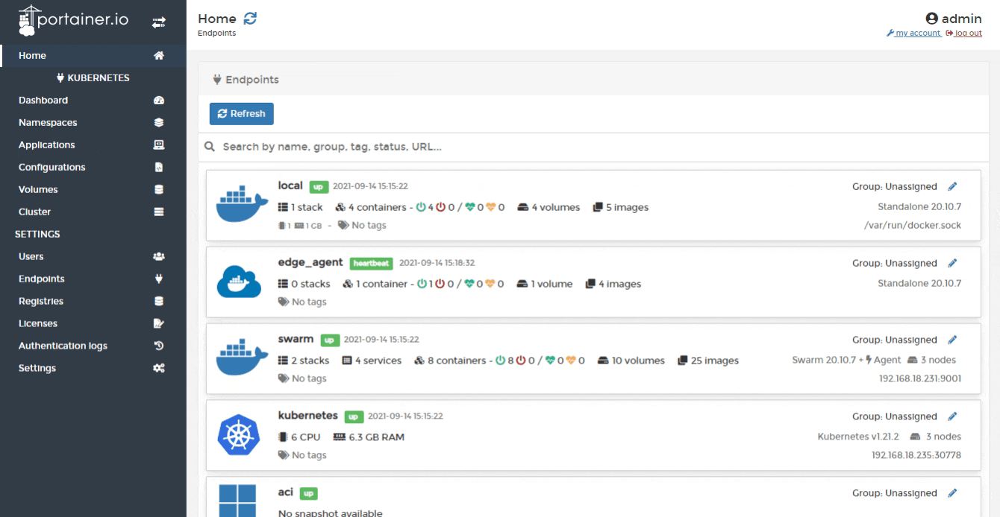

# Add an application

From the menu select **Applications** then click **Add application**.

Complete the required information, using the table below as a guide.

| Field/Option | Overview |
| :--- | :--- |
| Name | Give the application a descriptive name. |
| Image | Enter the name \(and optionally the tag\) of the image that will be used to deploy the application. |
| Namespace | Select the namespace where the application will reside. If you need to add a new namespace, go [here](../namespaces/add.md). |
| Stack | Portainer can automatically bundle multiple applications inside a stack. Enter the name of a new stack, select an existing stack from the list, or leave empty to use the application name. |

<table>
  <thead>
    <tr>
      <th style="text-align:left">Field/Option</th>
      <th style="text-align:left">Overview</th>
    </tr>
  </thead>
  <tbody>
    <tr>
      <td style="text-align:left">Environment variables</td>
      <td style="text-align:left">Define any environment variables for the application.</td>
    </tr>
    <tr>
      <td style="text-align:left">Configurations</td>
      <td style="text-align:left">Select any configuration files you have previously created to make available
        to the application.</td>
    </tr>
    <tr>
      <td style="text-align:left">Persisting data</td>
      <td style="text-align:left">Define any persistent folders within the application and whether these
        are new or existing volumes, as well as the size of the volume and storage
        location.</td>
    </tr>
    <tr>
      <td style="text-align:left">Data access policy</td>
      <td style="text-align:left">
        
You have two options when specifying how data will be used across instances:

        

        
<b>Isolated:</b> Each instance of the application will use its own data.

        
<b>Shared</b>: All application instances will use the same data.

      </td>
    </tr>
  </tbody>
</table>

<table>
  <thead>
    <tr>
      <th style="text-align:left">Field/Option</th>
      <th style="text-align:left">Overview</th>
    </tr>
  </thead>
  <tbody>
    <tr>
      <td style="text-align:left">Resource reservations</td>
      <td style="text-align:left">Define the amount of memory and CPU available to the application.</td>
    </tr>
    <tr>
      <td style="text-align:left">Deployment</td>
      <td style="text-align:left">
        
Choose how you want to deploy the application inside the cluster. Options
          are:

        

        
<b>Replicated</b>: Run one or multiple instances on this container.

        
<b>Global</b>: Deploy an instance of this container on each cluster node.

      </td>
    </tr>
    <tr>
      <td style="text-align:left">Instance count</td>
      <td style="text-align:left">Define the number of instances of the application to run.</td>
    </tr>
  </tbody>
</table>

<table>
  <thead>
    <tr>
      <th style="text-align:left">Field/Option</th>
      <th style="text-align:left">Overview</th>
    </tr>
  </thead>
  <tbody>
    <tr>
      <td style="text-align:left">Placement rules</td>
      <td style="text-align:left">Define which placement rules must be followed by the nodes where the application
        is deployed to. Placement rules are based on node labels.</td>
    </tr>
    <tr>
      <td style="text-align:left">Placement policy</td>
      <td style="text-align:left">
        
Select which policy to associate with the placement rules. Options are:

        

        
<b>Mandatory:</b> The application will only be scheduled on nodes that
          follow all rules.

        
<b>Preferred</b>: If possible, the application will be scheduled on nodes
          that follow all rules.

      </td>
    </tr>
    <tr>
      <td style="text-align:left">Publishing the application</td>
      <td style="text-align:left">
        
Select how you want to publish the application. Options are:

        

        
<b>Internal</b>: Internal communications inside the cluster only.

        
<b>Cluster</b>: Publish via a port on all cluster nodes.

      </td>
    </tr>
    <tr>
      <td style="text-align:left">Published ports</td>
      <td style="text-align:left">Define the published ports for the application. Only applicable if you
        selected the <b>Cluster</b> publishing method.</td>
    </tr>
  </tbody>
</table>

When you have finished, click **Deploy application**.

