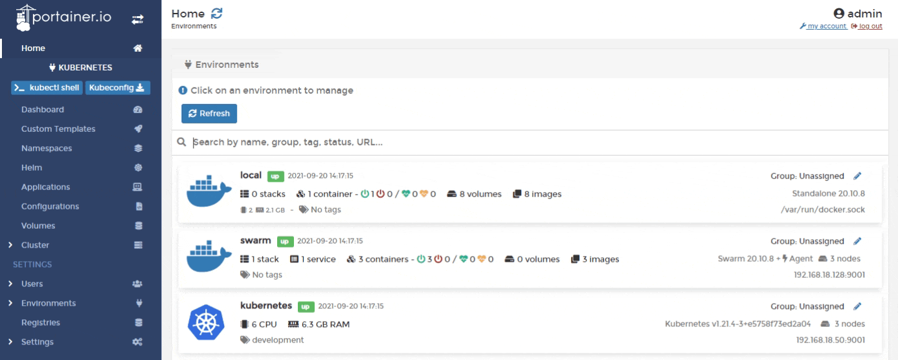
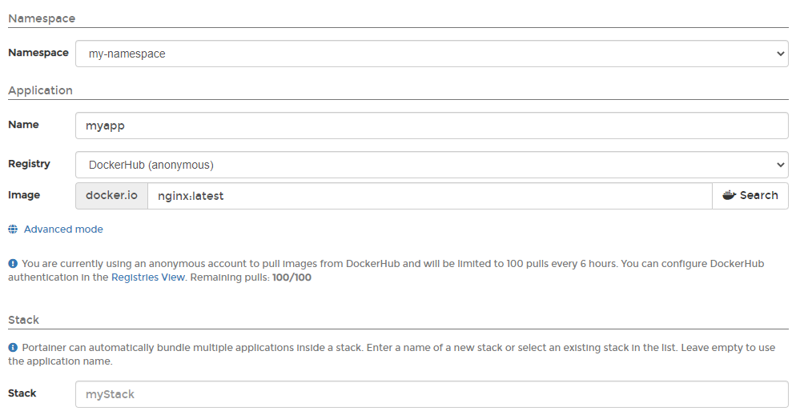
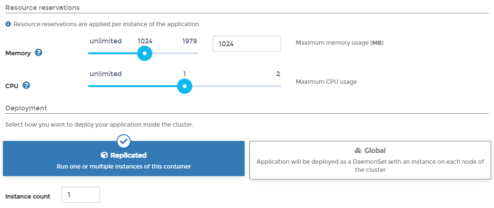
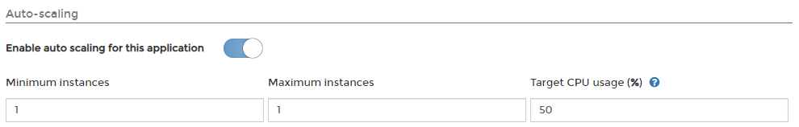
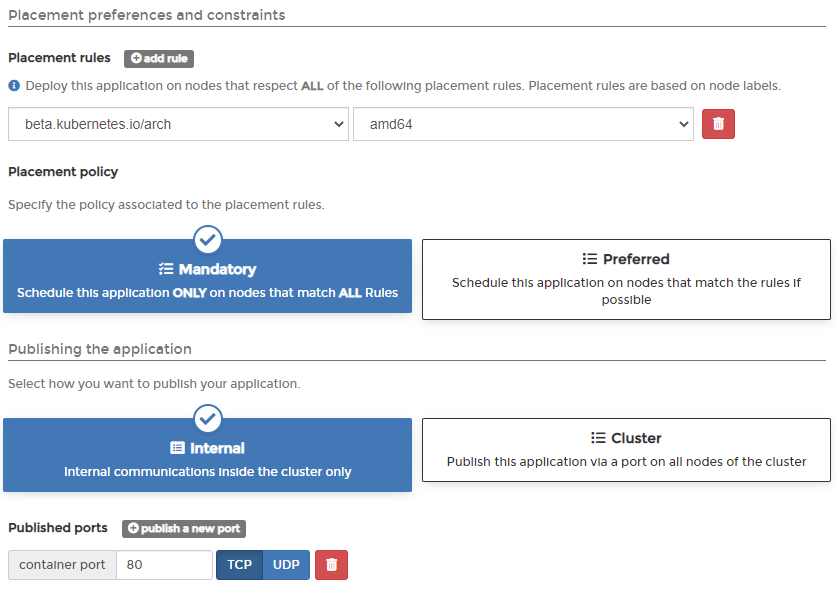

# Add a new application manually

There are two ways to add a new application: manually by using a form or automatically by [using a manifest](manifest.md). This article explains how to add an application manually.

From the menu select **Applications** then click **Add application with form**.

Complete the required information, using the table below as a guide.

| Field/Option | Overview                                                                                                                                                                                                   |
| ------------ | ---------------------------------------------------------------------------------------------------------------------------------------------------------------------------------------------------------- |
| Namespace    | Select the namespace where the application will reside.                                                                                                                                                    |
| Name         | Give the application a descriptive name.                                                                                                                                                                   |
| Registry     | Select the registry to pull the image from. If you want to pull from a registry that is not configured with Portainer, click **Advanced mode** then enter the URL and image manually.                      |
| Image        | Enter the name (and optionally the tag) of the image that will be used to deploy the application.                                                                                                          |
| Stack        | Portainer can automatically bundle multiple applications inside a stack. You can either enter the name of a new stack, select an existing stack from the list, or leave empty to use the application name. |

| Field/Option          | Overview                                                                                                                                                                   |
| --------------------- | -------------------------------------------------------------------------------------------------------------------------------------------------------------------------- |
| Environment variables | Define any environment variables for the application.                                                                                                                      |
| Configurations        | Select any configuration files you have previously created to make them available to the application.                                                                      |
| Persisting data       | Define any persistent folders within the application and whether these are new or existing volumes, as well as the size of the volume and storage location.                |
| Data access policy    | You have two options when specifying how data will be used across instances:                                                                                               |
|                       | 
<strong>Isolated:</strong> Each instance of the application will use its own data.

<strong>Shared</strong>: All application instances will use the same data.
 |

| Field/Option          | Overview                                                                                                                                                                       |
| --------------------- | ------------------------------------------------------------------------------------------------------------------------------------------------------------------------------ |
| Resource reservations | Define the amount of memory and CPU available to the application.                                                                                                              |
| Deployment            | Choose how you want to deploy the application inside the cluster. Options are:                                                                                                 |
|                       | 
<strong>Replicated</strong>: Run one or multiple instances on this container.

<strong>Global</strong>: Deploy an instance of this container on each cluster node.
 |
| Instance count        | Define the number of instances of the application to run.                                                                                                                      |

| Field/Option                             | Overview                                                                                                                                                                                                               |
| ---------------------------------------- | ---------------------------------------------------------------------------------------------------------------------------------------------------------------------------------------------------------------------- |
| Enable auto scaling for this application | Toggle this to enable auto-scaling for the application you are deploying. This requires that the Kubernetes metrics server is installed and [enabled in the cluster setup](../cluster/setup.md#resources-and-metrics). |
| Minimum instances                        | Enter the minimum number of instances that you want running for this application.                                                                                                                                      |
| Maximum instances                        | Enter the maximum number of instances that you want running for this application.                                                                                                                                      |
| Target CPU usage                         | Enter the target CPU percentage for your application. The autoscaler will ensure that enough instances are running to maintain an average CPU usage of this value across all instances.                                |

| Field/Option               | Overview                                                                                                                                                                                                                   |
| -------------------------- | -------------------------------------------------------------------------------------------------------------------------------------------------------------------------------------------------------------------------- |
| Placement rules            | Define which placement rules must be followed by the nodes where the application is deployed to. Placement rules are based on node labels.                                                                                 |
| Placement policy           | Select which policy to associate with the placement rules. Options are:                                                                                                                                                    |
|                            | 
<strong>Mandatory:</strong> The application will only be scheduled on nodes that follow all rules.

<strong>Preferred</strong>: If possible, the application will be scheduled on nodes that follow all rules.
 |
| Publishing the application | Select how you want to publish the application. Options are:                                                                                                                                                               |
|                            | 
<strong>Internal</strong>: Internal communications inside the cluster only.

<strong>Cluster</strong>: Publish via a port on all cluster nodes.
                                                                |
| Published ports            | Define the published ports for the application. Only applicable if you selected the **Cluster** publishing method.                                                                                                         |

When you have finished, click **Deploy application**.
