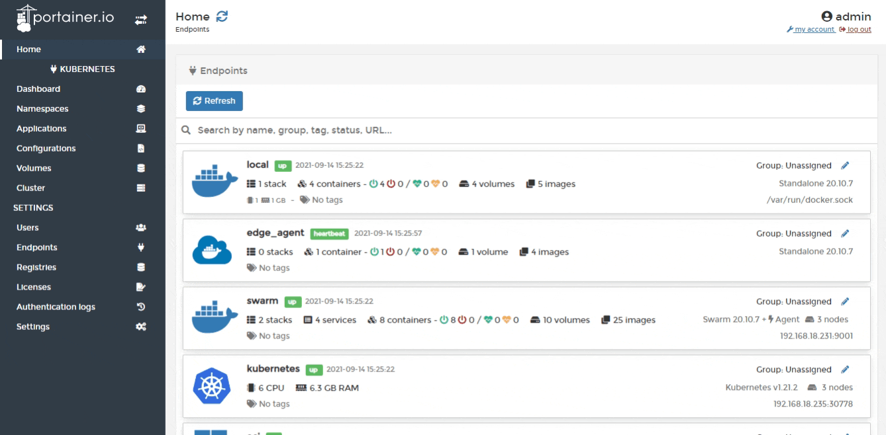
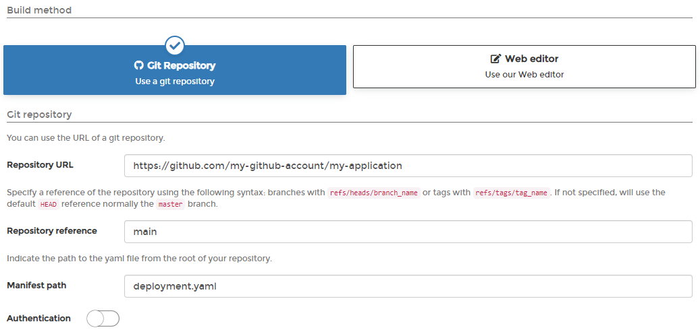
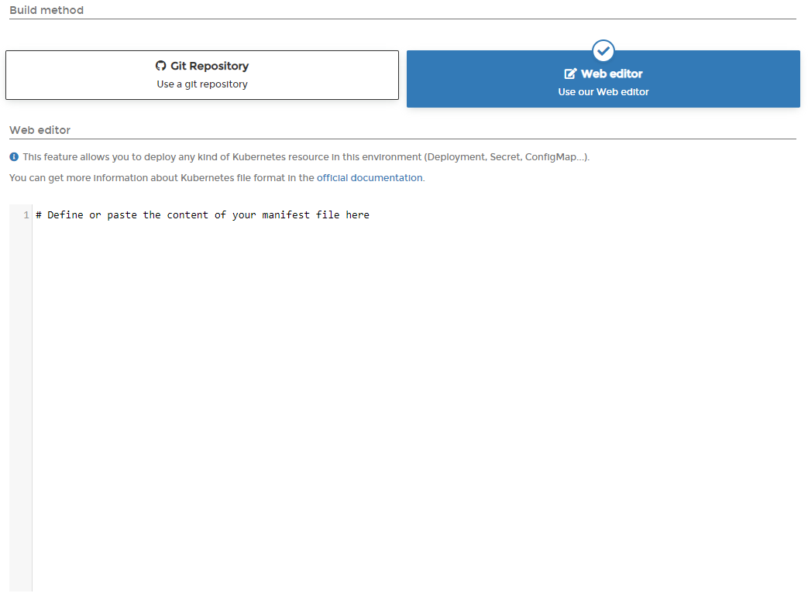

# Advanced application deployment

In Portainer, you can launch new applications using your current manifest in YAML for Kubernetes, or convert from a Docker Compose file format.


Portainer uses Kompose to convert a Compose manifest to a Kubernetes-compliant manifest. Be aware that currently not all Compose format options are supported by Kompose.


From the menu select **Applications** then click **Advanced deployment**.

You have the option to deploy using either a manifest file in a Git repository or by entering the YAML manifest into the Portainer web editor.

## Option 1: Manifest from Git

Select the namespace to deploy the application to, then select either **Kubernetes** or **Compose** \(depending on the format of the manifest\). Select **Git Repository** then enter the details of your Git repo:

* Repository URL.
* Repository reference.
* Manifest path.

Toggle the **Authentication** option on, then enter the authentication details required by the repo. When you're ready, click **Deploy**.

## Option 2: Manifest using the web editor

Select the namespace to deploy the application to, then select either **Kubernetes** or **Compose**. Select **Web Editor** then write or paste in your Kubernetes manifest. 

When you're ready, click **Deploy**.  

